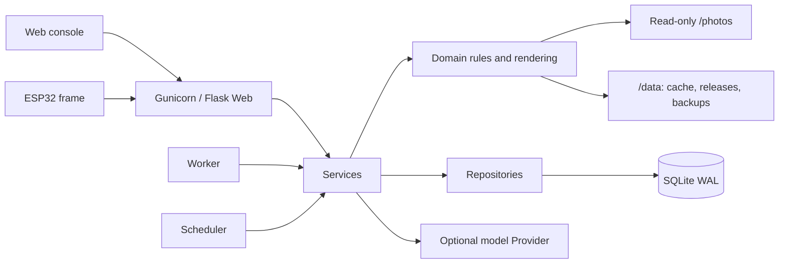

# InkTime · Photo analysis and e-ink memory frames

> Documentation checked on 2026-09-22 against `main` at `66c8222`. SQLite Migration 63, AI Schema v5, firmware 2.8.7, Config Store v5 and NAS deployment contract 3 are separate versions. Check the deployed Git revision in Diagnostics; see the [source baseline](docs/reference/CURRENT_STATE_ZH_TW.md).

[繁體中文](README.md) · [Documentation map](docs/README.md) · [HTML manual](USER_MANUAL.html) · [Quick start](docs/getting-started/QUICK_START_ZH_TW.md)

InkTime scans a read-only photo library, selects suitable memories, renders versioned e-ink images and serves them to ESP32 frames. A Traditional Chinese Web console manages photos, jobs, providers, costs, schedules, devices, backups and diagnostics. New installations work locally without a model API key. AI analysis is an explicit choice.


## Start here

| Goal | Entry point |
|---|---|
| Display a first photo | [Installation](#installation) → [First use](#first-use) |
| Understand AI calls and charges | [Analysis modes](#analysis-modes) → [Cost and paid-request recovery](#cost-and-paid-request-recovery) |
| Follow code and data flow | [Architecture](#architecture) and the [detailed Chinese flow diagrams](README.md#完整程式流程圖從啟動照片分析到電子紙顯示) |
| Maintain an existing deployment | [Updates, backups and retention](#updates-backups-and-retention) |
| Edit with a small agent context | [Agent workflow](#agent-workflow) |
| Connect hardware | [Rendering and devices](#rendering-and-devices) and the board-specific sections below |

## Capabilities

- Local EXIF, SHA-256, pHash/dHash, exposure and quality analysis; original files remain read-only.
- JPEG, PNG, WEBP, TIFF, BMP and HEIC/HEIF input, including supported 48MP HEIC. Preview and AI inputs are generated JPEGs. ProRAW DNG, GIF and Live Photo MOV are not supported photo inputs; see the [image-format contract](docs/architecture/IMAGE_FORMAT_CONTRACT_ZH_TW.md).
- Local-only selection, on-this-day selection, preferences, favorites, pair layouts and display-history filters.
- One normal Vision image request producing strict Schema v5 scores, classification, a short caption and orientation; stored v4 results remain readable.
- Compatible result inheritance, request-fingerprint caching, persisted jobs, bounded workers, pause/resume/cancel and restart recovery.
- Provider-specific models and prices, OpenRouter routing/privacy options, AI Trace and explicit unknown-cost handling.
- Optional OpenAI Files/Batch lifecycle with upload, submission, polling, result import, cleanup and manual recovery for ambiguous remote outcomes. OpenRouter does not use this Batch path.
- Versioned releases for four-, six- and seven-color profiles, previews, checksums and rollback.
- Physical pairing, per-device credentials, configuration ACKs, offline queues, optional enhanced schedules and device notifications.
- Administrator/viewer roles, session/CSRF protection, encrypted secrets, backups and diagnostics.

Decision Trace, Shadow and Canary are optional workflows. Retention has separate automatic-cleanup defaults; review these before upgrading.

## Analysis modes

Configure `analysis.execution_mode` in Settings. Adding a Provider or API key does not enable ordinary background AI work.

| Mode | Ordinary processing | Explicit manual photo AI | Data and cost |
|---|---|---|---|
| `disabled` | Reject new analysis | Disabled | Existing photos/releases remain readable |
| `local_only` (default) | Local features and selection | Disabled | Normal photo processing does not read a Provider or use model tokens |
| `local_with_manual_ai` | Local features and selection | Allowed | A deliberate manual action can upload an image and incur cost |
| `automatic_ai` | AI jobs allowed by policy | Allowed | Provider, scope, photo limits and budgets still apply |

Provider diagnostics, scoring-lab tests and live benchmarks are separate operations; image tests can incur charges. An external Provider receives the image and prompt included in that request. Resizing reduces payload size but does not remove personal content. Upload restrictions, display restrictions and content-filter decisions have distinct purposes.

### Schema and selection

New responses use [Schema v5](docs/VISION_SCHEMA.md): `types`, `memory_score`, `visual_score`, `special_level`, `side_caption`, `content_filter` and `visual_orientation`, plus `schema_version`. The short caption is 8–16 characters. New output no longer requires a long caption, people count, special codes or composition/text-safe-area fields.

Normal photo analysis extracts JSON locally and validates it. It does not request a second model call for JSON repair or long-caption generation. Provider diagnostics, scoring-lab tests and benchmark repair are separate bounded flows. Legacy strategy names normalize to `single`; they do not restore two-stage image analysis.

Stored v4/v5 semantic results remain usable under their own validation rules. Historical v1–v3 records remain readable but do not enter current semantic ranking. Updating the schema does not itself authorize paid reanalysis.

```text
base = round(memory_score × 0.67 + visual_score × 0.33, 2)
effective_special_level = min(4, special_level + (1 if favorite else 0))
bonus = [0, 2, 5, 9, 14][effective_special_level]
ranking_score = round(clamp(base + bonus, 0, 100), 2)
```

Local quality is a candidate gate, not a ranking weight. E6 suitability affects display suitability, not this formula. Favorites raise the special level by one and do not bypass AI content exclusions. See the [selection contract](docs/analysis/PHOTO_SELECTION_AI_FIRST_ZH_TW.md).

## Architecture



All three services use the same application image and data directory. Web handles HTTP and administration, Worker claims persisted jobs, and Scheduler enqueues work and performs scheduled maintenance. A healthy Web service alone does not prove the Worker is processing jobs.

| Path | Responsibility |
|---|---|
| `server.py`, `inktime/app/factory.py`, `bootstrap.py` | Application entry and role-specific assembly |
| `inktime/app/api/`, `web/` | HTTP, authorization, templates and browser assets |
| `inktime/app/services/` | Analysis, budgets, rendering, publication, backup workflows |
| `inktime/app/domain/` | Photo, schema, ranking and rendering rules |
| `inktime/app/repositories/`, `db/` | SQL, settings, persistence, locks and migrations |
| `inktime/app/providers/` | External model protocols, routing and usage |
| `inktime/app/workers/` | Scanner, Worker and Scheduler |
| `esp32/` | Board-specific firmware |
| `scripts/`, `.github/workflows/` | Deployment/recovery tools and Hosted CI |
| `tests/`, `docs/` | Behavior contracts and task-specific documentation |

### Photo-to-frame lifecycle

1. An administrator or schedule creates a scan job for the mounted library.
2. Worker reads metadata, fingerprints and local quality; unsupported files and unsafe candidates are excluded without deleting originals.
3. Local processing completes without AI. An allowed `single` job uses compatible inheritance/cache or one new Vision request.
4. Candidate selection verifies analysis/local-feature requirements, eligibility, library state and source-file availability.
5. Renderer composes the selected layout, font and panel palette into a preview and binary payload.
6. `ReleaseCoordinator` validates the staged files, changes profile pointers and records publication/history, with compensation on failure.
7. The device retrieves its queue/manifest, verifies exact payload length and SHA-256, and reports download/display status.
8. The console exposes release history, usage, traces, device events and errors. Publication and a physical refresh are different evidence.

For ownership boundaries and exact call sites, see the [architecture guide](docs/architecture/ARCHITECTURE_ZH_TW.md).

## Installation

Docker Engine 24+ and Compose v2 are the documented container baseline. Native Python requires 3.10+; the production image uses Python 3.12. Keep the writable SQLite data directory separate from the read-only photo library. The N100 defaults use one Web worker and bounded analysis concurrency.

### Production NAS

Prepare matching deployment files, `.env.nas`, existing canonical data/photo directories, UID/GID `10001:10001` permissions and a real public/LAN URL following the [NAS deployment guide](docs/operations/NAS_TAG_DEPLOYMENT_ZH_TW.md).

```bash
# Replace vX.Y.Z with an already published image tag.
sudo ./scripts/update_nas.sh --initialize vX.Y.Z
# Later updates omit --initialize:
sudo ./scripts/update_nas.sh vX.Y.Z
```

The updater checks the marker, lock, deployment contract and recovery point before recreating services with `--no-build`. A Git tag alone does not prove an image is published. Do not bypass this flow with an ad hoc production build or delete data volumes.

HTTPS, secure cookies and trusted reverse-proxy headers are the production baseline. Trusted-LAN HTTP is an explicit degraded mode and must not be exposed to the Internet. See [production deployment](docs/operations/PRODUCTION_DEPLOYMENT_GUIDE_ZH_TW.md).

### Local Docker development or simulation

```bash
cp .env.local.example .env
# Set real data/photo paths, INKTIME_DEV_PUBLIC_URL and bind address.
docker compose -f docker-compose.yml -f docker-compose.dev.yml up -d --build
docker compose -f docker-compose.yml -f docker-compose.dev.yml ps
```

The development override exposes Web to the LAN by default. For local-only use, set `INKTIME_DEV_BIND_ADDRESS=127.0.0.1` and a matching local URL. Do not recursively change photo-library ownership to fix data-directory permissions.

These commands are deployment examples. Routine agent tests/builds run in Hosted CI under [AGENTS.md](AGENTS.md).

### Native development

```bash
python3 -m venv .venv
source .venv/bin/activate
pip install -r requirements.txt
export INKTIME_ENVIRONMENT=development
export INKTIME_DATA_DIR="$PWD/data"
export INKTIME_PHOTO_DIR="$PWD/simulation_photos"
python server.py
```

Run `python -m inktime.app.workers.runner` and `python -m inktime.app.workers.scheduler` in separate terminals with the same environment. Native processes do not automatically load the Compose `.env`. Production Web uses `gunicorn --config gunicorn.conf.py server:app`, not Flask's development server. See [runtime configuration](docs/architecture/RUNTIME_CONFIGURATION.md).

`analyze_photos.py` is a compatibility command that creates persisted jobs and runs one Worker iteration; it is not the retired standalone analyzer. Remaining jobs require the Worker service.

## First use

1. Open `/setup`, create the first administrator and sign in.
2. Scan the container path `/photos` from Maintenance. Host paths and container paths are different.
3. Start with local-only processing and preview in `/simulator`; `/virtual-display` can receive published manifest/binary output without a physical frame.
4. If AI is wanted, explicitly enable a suitable mode, configure Provider/model/key/prices, and test a small non-sensitive sample. Synthetic image tests can cost money.
5. Inspect `/jobs`, `/activity`, `/ai/traces` and usage together; `completed` does not by itself prove a model call.
6. Preview and publish from Rendering using a profile matching the physical panel.
7. For a new frame, approve its physical pairing code in Devices; recoverable claim/confirm provisions the per-device secret.
8. Back up metadata and separately protect the matching session key, original photos and release files according to the chosen recovery plan.

## Rendering and devices

| Wire profile | Dimensions | Payload |
|---|---|---|
| `safe_4c` | 480×800 | 2bpp, 96,000 bytes |
| `gdep073e01_6c` | 480×800 | indexed4, 192,000 bytes |
| `gdey073d46_7c` | 480×800 | indexed4, 192,000 bytes |

PhotoPainter adapts the wire image to the native 800×480 panel. New rendering defaults are six-color `gdep073e01_6c`, `gooddisplay`, `photo_info`, portrait and `stretch_fill`; always match the actual panel. Eight layouts include single/pair-photo choices, calendar and weather/sensor layouts; the latter two require portrait orientation.

Device credentials belong in protected configuration, never in URLs. New devices use Device Secret pairing; Legacy Bearer and PhotoPainter Stock `/dataUP` remain distinct compatibility paths. Queue-first delivery, checksum validation, persisted ACKs and safe same-content refresh skipping are detailed in the [device protocol](docs/devices/DEVICE_PROTOCOL_ZH_TW.md).

Enhanced PhotoPainter uses Internal FFat, with a 40-frame formal-cache limit and a 16-slot/day capability. Config Store v5 can read older 24-slot payloads; this is not permission to assign 24 new daily slots. The 13.3-inch beta uses an old protocol and has no matching current Web profile.

## Cost and paid-request recovery

- Normal Vision defaults to a 1024px image; 1600px is configurable, while the lower-level plan/benchmark also supports 512px.
- Exact compatible content and request fingerprints can reuse saved results. Provider configuration that changes request semantics can invalidate that compatibility.
- Usage distinguishes `provider_reported`, `estimated` and `unknown`. Missing usage is not a zero-token or free response.
- Persisted billable-operation checkpoints survive Worker restart. An ambiguous remote outcome blocks automatic resend, including after a cache lease expires.
- Unknown reservations do not expire merely because 24 hours elapsed. Reclaiming budget requires evidence of no send or reconciled cost.
- Daily, monthly, job and photo limits control work; estimates are not a promise of the final invoice.

Provider connection tests, scoring-lab tests, explicit retries and live benchmarks have their own request accounting. OpenAI Batch is a separate remote lifecycle and needs its own acceptance evidence. See the [cost guide](docs/reference/TOKEN_COST_GUIDE_ZH_TW.md), [OpenRouter guide](docs/providers/OPENROUTER_ZH_TW.md) and [Batch guide](docs/OPENAI_BATCH_ANALYSIS_ZH_TW.md).

## Updates, backups and retention

Use the NAS updater with a published compatible tag and retain the recovery point until verification is complete. Migrations run forward and released migrations must not be rewritten.

| Backup | Scope | Separate protection needed |
|---|---|---|
| Web metadata ZIP | Sanitized DB, non-secret settings, manifest/checksums | Session key, original photos and release payloads |
| NAS update recovery point | Update-time DB, protected key and image identity | Independent photo/file backup |
| Filesystem snapshot | Selected original/release files | Consistent DB and matching credentials |

Offline restore requires all three processes to stop and an exclusive lock. Ordinary restore can migrate forward; `--exact-snapshot` preserves the old schema and requires its matching compatible image. Do not restore a live `.db` independently of WAL state.

Migration 62 records a runtime key fingerprint. A known fingerprint mismatch raises `SESSION-003`; recover the matching key rather than deleting the guard. Older backups without a fingerprint still need independent identity checks. Migration 63 repairs known `types` enum locations without rewriting captions or raw Provider responses.

Default retention includes AI Trace 30 days and API usage 400 days. For untouched policies, Migration 62 enables automatic cleanup of Decision Trace (180 days), candidates (60), device events (180), queue events (90) and job logs (30). Administrator changes are preserved. Shadow's policy remains observation-only because its cleanup handler is not implemented. Photo-analysis-history cleanup has its own dry-run digest and confirmation flow.

See [backup/restore](docs/operations/BACKUP_RESTORE_ZH_TW.md), [secret recovery](docs/operations/SECRET_RECOVERY_ZH_TW.md) and [retention](docs/resilience/DATA_RETENTION_ZH_TW.md).

## Troubleshooting and evidence

| Symptom | First check |
|---|---|
| Web is ready but work does not progress | Worker/Scheduler heartbeat, queue state and active mode |
| Job completed without a new caption/cost | Local, prefilter, inherited or cached result; actual attempts and usage |
| Unknown cost after timeout | Saved operation and Provider accounting; no blind resend |
| Published release but unchanged panel | Device-specific manifest, payload hash, ACK and physical display |
| Empty power dashboard | Actual paired-device telemetry and sample timestamps |
| Startup rejects a session key | `SESSION-003`, matching backup/key identity |

A source check, Hosted CI, published image, running NAS and physical panel acceptance are separate claims. This documentation refresh does not perform paid API calls, deployment or flashing. Dated reports record only their original evidence.

## Agent workflow

[AGENTS.md](AGENTS.md) is the single agent-rule entry point; do not add a duplicate `AGENT.md` or `CLAUDE.md`. Open the actual Git root/worktree. Known paths/symbols use TARGETED directly, without preloading this README, the HTML manual or all docs/tests.

The first pass is bounded to 3 files / 300 lines, with evidence-based expansion. Defer secrets, runtime data, databases, logs, binaries and historical reports unless an exact task requires them. Unknown locations can use one [navigation route](docs/AI_NAVIGATION.md) backed by the [machine-readable index](docs/AI_CONTEXT_INDEX.json). The tool prints paths only by default; `--symbols` explicitly reads candidates.

Docs/navigation changes run `python3 scripts/ci/validate_ai_navigation.py`. General tests/builds remain in Hosted CI. Keep PRs Draft and inspect new CI once; report pending work accurately. These rules reduce unnecessary reading, but cannot remove client-injected history/tools or guarantee account-quota savings. See the [development guide](docs/getting-started/DEVELOPMENT_GUIDE_ZH_TW.md).

## ESP32 hardware reference

## Hardware and Pins

The custom PCB details below apply to the generic board profile, not the PhotoPainter pin map or button behavior.

#### MCU

This project uses the Espressif ESP32-S3-N8R8 module.

Use a supported compile-time board profile. GPIO, flash partitions, PSRAM and panel drivers must match the actual board; arbitrary ESP32 boards are not interchangeable.

#### Display

The current server provides three 480×800 wire profiles: safe four-color, GDEP073E01 six-color and GDEY073D46 seven-color. The matching compile-time driver and physical adapter are described in the ESP32 guide; PhotoPainter uses its dedicated board adapter.

Adding another size or model requires matching server payload, firmware driver, memory and hardware validation; changing only the display constructor is insufficient.

#### E-Ink Adapter Board

This project uses the 49-pin seven-color EPD adapter board made by the Bilibili creator "记得带马扎".

Connector pin count alone does not prove compatibility. Match the controller, voltage, pinout and selected panel profile before connecting hardware.

#### Pin Definitions

The e-ink display communicates over SPI. The default pins are:

- `PIN_EPD_BUSY = 14`
- `PIN_EPD_RST  = 13`
- `PIN_EPD_DC   = 12`
- `PIN_EPD_CS   = 11`
- `PIN_EPD_SCLK = 10`
- `PIN_EPD_DIN  = 9`

### PCB Assembly

The schematic, BOM, and PCB fabrication files are in the ```esp32/pcb``` folder.

H1-H6 in the schematic are test pads and do not need real components soldered:

- H1: UART serial
- H2: USB
- H3: BOOT pin. Short this pin to GND before powering on when flashing firmware.
- H4: Connects to the EPD adapter board
- H5: 3.7V battery pads
- H6: 5V input test pads

UART flashing is recommended. R2, R3, C5, and C6 are used for USB; leave them unpopulated if USB is not needed.

SW1: RESET button. Pressing it restarts the device and downloads/displays the image once. It can also wake the device from long deep sleep.  
SW2: Wi-Fi reset button. Hold SW2 and press SW1; after restart, the ESP32 clears NVS so Wi-Fi can be configured again.  
SW3 / SW4: Reserved GPIOs for possible future features. Leave them unpopulated if not needed.

Example PCB:

<p align="left">
  
</p>

## Build and Flash

The shared 7C/PhotoPainter source currently declares firmware **2.8.7**. Use the exact Hosted CI profile, pinned dependencies and repository-owned partition table described in the [ESP32 guide](docs/devices/ESP32_GUIDE_ZH_TW.md).

PhotoPainter Rev2.0 requires 16 MiB flash, 8 MiB OPI PSRAM, TG28 ALDO4 power handling and its own GPIO map. Read the [compact safety contract](docs/devices/PHOTOPAINTER_SAFETY_CONTRACT.md) and the exact flashing/recovery sections of the [PhotoPainter guide](docs/devices/WAVESHARE_PHOTOPAINTER_ZH_TW.md) before flashing. Keep ALDO3 / Audio_VCC powered; unpowered audio codecs can clamp the shared I2C bus. Preserve a full local flash backup; an app-only binary belongs at `0x10000`, never `0x0`. GPIO0 remains BOOT and GPIO5 remains the factory PWR button.

The 13.3-inch beta sketch uses a retired download protocol and is not integrated with the current Web release profiles.

### Custom Fonts (optional)

InkTime includes two offline Traditional Chinese choices in the Rendering page: Iansui for a handwriting style and LXGW WenKai TC for a literary style. Administrators can preview and switch between them, or upload a TTF/OTF/TTC file up to 64 MiB. Formal rendering checks every caption character and fails explicitly instead of silently falling back to Pillow's default font.

## First-Time Configuration

On startup, the device tries to read saved Wi-Fi credentials from NVS. If credentials are missing or Wi-Fi connection fails, it automatically enters AP configuration mode:

- The device starts an AP hotspot: `InkTime-xxxx`
- The current ESP32-S3 PhotoPainter firmware generates a new AP password at runtime when configuration mode starts: an 8-digit random numeric value. It is not a fixed default and is not derived from the SSID, MAC address, or chip ID; the password is shown on the device pairing/configuration screen.
- Connect to the AP and open the configuration page in a browser: `http://192.168.4.1/`
- Configure Wi-Fi and the InkTime server address. Approve the short-lived physical pairing code in the Web Devices page; the device completes recoverable claim/confirm before its normal workflow. Configure regular schedules in the Web console.

## Refresh and Sleep

Online devices validate a Queue or Release Manifest, exact payload length and SHA-256 before refreshing. `safe_4c` uses 96,000-byte 2bpp payloads; the six/seven-color profiles use 192,000-byte indexed4 payloads. Enhanced PhotoPainter can cache verified schedules in Internal FFat and use RTC-first offline slots. Identical validated content may skip a physical refresh while retaining the protocol ACK behavior.

PhotoPainter KEY1 double-click opens a read-only power page, holds it for 30 seconds after refresh, then restores the verified last successful Internal Flash frame. Long holds request forced network refresh or recovery as described in the device guide. GPIO0/5/21 are not repurposed for these actions.

Timeouts and the max-awake supervisor bound failure handling. Historical cold-start/KEY1 checks are documented separately; sleep current, timer accuracy and battery lifetime require measurements and are not guaranteed by source or CI.

## Related Projects

- ESP32 firmware depends on GxEPD2 © ZinggJM (GPL-3.0): https://github.com/ZinggJM/GxEPD2  
  If you distribute compiled firmware, please comply with GPL-3.0 as well.

- The offline Chinese city-name index in this project is built from GeoNames data:  
  GeoNames © GeoNames contributors, CC BY 4.0  
  https://www.geonames.org/

## Star History

<p align="center">
  <a href="https://star-history.com/#dai-hongtao/InkTime&Timeline">
    
  </a>
</p>
