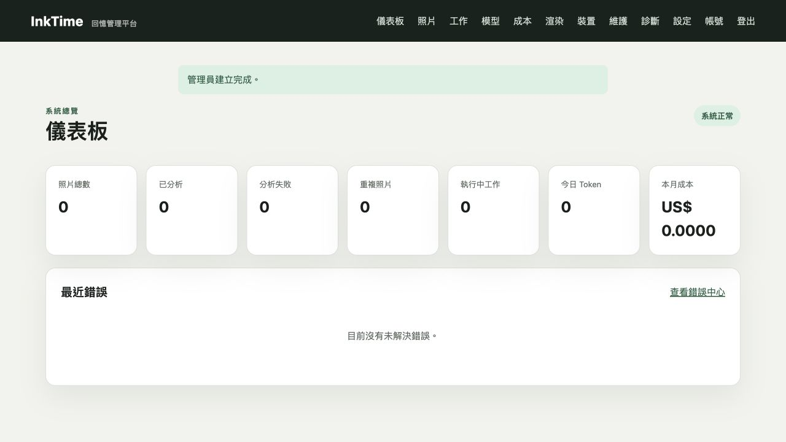
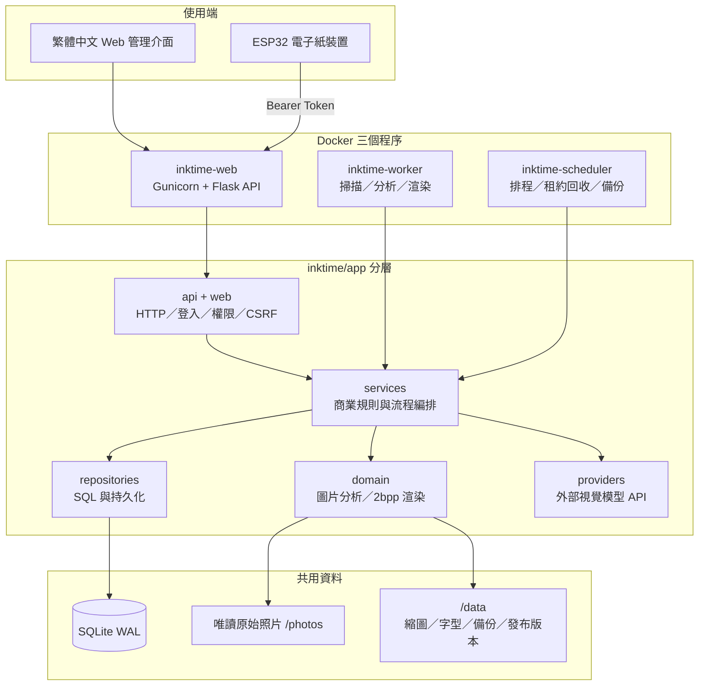

# InkTime｜照片分析與電子紙回憶管理平台

[English legacy README](README.en.md) · [快速開始](docs/QUICK_START_ZH_TW.md) · [專案架構與評分流程](docs/ARCHITECTURE_ZH_TW.md) · [使用指南](docs/USER_GUIDE_ZH_TW.md) · [管理指南](docs/ADMIN_GUIDE_ZH_TW.md)

InkTime 會在本地掃描相簿、擷取 EXIF 與品質特徵，先去除重複與低價值照片，再以可控預算的視覺模型產生繁體中文描述、分類、分數與電子紙短文案。所有工作、模型、成本、裝置、渲染、備份與診斷都能由登入後的 Web 管理介面操作。



## 主要能力

- 以 SHA-256、pHash、dHash、EXIF、亮度、對比、模糊與曝光做本地預處理；相同內容不重複呼叫模型。
- 512／1024／1600px 內容雜湊縮圖快取；預設不傳原始 4K／8K 圖片。
- 單一分析請求同時回傳描述、類型、四種分數、短文案與敏感判斷；JSON 最多純文字修復一次。
- 低成本第一階段與高品質第二階段；支援 OpenAI 即時、OpenAI 相容端點與本地相容端點；OpenAI Batch 已完成提交／查詢／取消 Provider 介面，但尚未接入背景工作的完整生命週期。
- 持久化 Job、逐張狀態、有界佇列、暫停、續跑、取消、失敗重跑、重啟恢復與成本停止線。
- administrator／viewer、Session、CSRF、登入限制與每台 ESP32 獨立 Bearer Token。
- 480×800 四色 2bpp 版本化發布，單張 96,000 bytes；Manifest、SHA-256、原子發布與回滾。
- 繁體中文管理介面、結構化 Log、錯誤中心、CPU／記憶體／SQLite／Worker 診斷與已遮蔽診斷包。

## 架構



從哪個目錄開始看、照片如何從掃描走到模型評分與電子紙發布，請見 [專案架構與評分流程](docs/ARCHITECTURE_ZH_TW.md)。詳細分層邊界請見 [目標架構](docs/ARCHITECTURE_TARGET.md)；重構前證據在 [工程稽核](docs/PROJECT_AUDIT_ZH_TW.md)。

### 目錄入口

| 路徑 | 用途 |
|---|---|
| `server.py` | Web 正式入口，組裝新版平台與舊版相容層 |
| `inktime/app/api/` | Route、登入權限、HTTP 輸入輸出 |
| `inktime/app/services/` | 分析、成本、渲染、備份等流程 |
| `inktime/app/repositories/` | SQLite 查詢、設定與資料存取 |
| `inktime/app/providers/` | OpenAI／相容模型呼叫、重試與用量 |
| `inktime/app/domain/` | 不依賴 Flask 的圖片、Schema、日期與 2bpp 邏輯 |
| `inktime/app/workers/` | 背景 Worker、Scheduler 與掃描器 |
| `inktime/app/web/` | 繁中管理介面的模板與 CSS |
| `esp32/` | 電子紙裝置韌體 |
| `docs/` | 安裝、架構、管理、成本、安全與維運文件 |

## Docker 快速安裝

需求：Docker Engine 24+ 與 Compose v2。先準備可寫資料目錄與唯讀照片目錄：

```bash
cp .env.example .env
# 編輯 .env 的 INKTIME_PHOTO_PATH；這是部署層必要路徑，不是日常分析參數。
docker compose up -d --build
```

開啟 `http://主機IP:8765/`，首次啟動精靈會要求建立至少 12 字元的管理員密碼。正式 HTTPS 反向代理請將 `INKTIME_COOKIE_SECURE=1`。

三個服務使用同一映像檔：

- `inktime-web`：Gunicorn 管理介面與裝置 API。
- `inktime-worker`：照片掃描、分析、重試與渲染工作。
- `inktime-scheduler`：租約回收、每日備份與保留策略。

完整 NAS、Volume 權限、唯讀 root filesystem 與更新方式見 [Docker 指南](docs/DOCKER_GUIDE_ZH_TW.md)。

## 首次使用

1. 建立管理員並登入。
2. 到「模型」新增 OpenAI、OpenAI 相容或本地端點；API Key 加密儲存且只顯示遮罩。
3. 到「維護」輸入容器內照片路徑（Compose 預設 `/photos`），建立背景掃描工作。
4. 到「工作」建立兩階段智慧分析，確認照片數、Token、費用範圍與工作預算後啟動。
5. 到「渲染」安裝涵蓋繁體中文的字型，測試渲染後發布 2bpp 版本。
6. 到「裝置」新增 ESP32；立即複製只顯示一次的 Token 到裝置 AP 設定頁。
7. 到「備份」建立並下載第一份備份。

## 不用修改程式碼的日常設定

一般、分析、模型、成本、渲染、裝置、系統、安全與備份設定都在「設定」頁。每次修改會記錄時間、使用者、來源 IP、舊值／新值摘要與是否需重新啟動；Secret 不會寫入歷史。完整欄位、預設值、範圍與風險見 [管理指南](docs/ADMIN_GUIDE_ZH_TW.md)。

## 照片評分與模型調整在哪裡

管理介面的「設定」與「評分」頁可調整：

- `model.low_model`、`model.high_model`：第一、第二階段使用哪個模型。
- 「評分」頁：照片高低分規則、四項綜合排序權重、最愛加分、版本歷史與單張測試台。
- `analysis.stage_two_threshold`：第一階段的回憶分達到多少才升級到高品質分析；人物或最愛照片也會升級。
- `render.memory_threshold`：電子紙歷史今日選片的最低回憶分門檻。

四項模型原始分數 `memory_score`、`beauty_score`、`technical_quality_score`、`emotion_score` 永遠保留；系統另以版本化權重計算 `ranking_score`，預設為回憶 50%、美觀 20%、技術 10%、情緒 20%，最愛照片再加 5 分（最高 100）。新規則只影響之後的分析；每筆分析會記住使用的規則版本。測試台照片只在暫存目錄停留，但模型 Token 與費用仍會記入成本頁。完整資料流見 [專案架構與評分流程](docs/ARCHITECTURE_ZH_TW.md)。

## Token 與成本控制

建議預設使用「兩階段智慧分析」：512px 低成本初篩，只有回憶分數達門檻、人物或最愛照片才使用 1600px 高品質模型。相同 SHA-256 繼承既有結果；短文案與所有分數在同一階段圖片請求輸出。管理介面提供每日、每月、單工作與單張照片停止值。詳見 [Token 成本指南](docs/TOKEN_COST_GUIDE_ZH_TW.md)。

## ESP32 配對與可靠性

新版韌體不再把金鑰放在 URL。裝置先以 Bearer Token 取得 Manifest，隨機選檔後驗證尺寸與 SHA-256，成功才解包到 framebuffer；所有檔案失敗時保留舊畫面。韌體需安裝 `GxEPD2` 與 `ArduinoJson`。詳見 [ESP32 指南](docs/ESP32_GUIDE_ZH_TW.md)。

## 原生安裝與相容 CLI

需求為 Python 3.10+（正式映像使用 Python 3.12）：

```bash
python3 -m venv .venv
source .venv/bin/activate
pip install -r requirements.txt
python server.py                 # 僅本機開發
python -m inktime.app.workers.runner
```

正式環境不可使用 Flask Development Server；請使用 Docker 或 `gunicorn server:app`。舊 `analyze_photos.py` 命令仍可使用，但已改為建立新版持久化 Job；原單檔實作保存在 `legacy_analyze_photos.py` 供遷移比較，不建議執行。

## 安全注意事項

- 不要 Commit `.env`、`config.py`、資料庫、Session Key、API Key 或裝置 Token。
- 公網部署必須使用 HTTPS、Secure Cookie、反向代理限流與 NAS 最小權限。
- 舊 `/static/inktime/<key>/...` API 預設關閉；只有隔離網路短期遷移才可明確開啟。
- viewer 只能查看，不能修改設定、建立／控制工作、管理 Token、發布或備份。

詳見 [安全指南](docs/SECURITY_GUIDE_ZH_TW.md)與[錯誤碼](docs/ERROR_CODES_ZH_TW.md)。

## 更新、遷移與回滾

更新前先從介面建立備份，再拉取映像並執行 `docker compose up -d --build`。Migration 使用版本、交易、升級前備份與 `quick_check`；任何失敗會停止啟動。回滾時停止三個服務、驗證備份、恢復舊資料庫與映像。詳細步驟見 [遷移指南](docs/MIGRATION_GUIDE_ZH_TW.md)與[備份還原](docs/BACKUP_RESTORE_ZH_TW.md)。

## 常見問題

- 沒有照片：到「維護」確認容器路徑是 `/photos` 且 Volume 可讀。
- 工作不動：到「診斷」確認 Worker 與 Queue，再看「錯誤中心」。
- 模型結果無效：確認模型支援 JSON Schema；系統只修復一次，避免無限成本。
- 繁中變方框：到「渲染」上傳 Noto Sans/Serif CJK TC 等涵蓋所需字元的字型。
- 裝置 401：Token 已撤銷、輸入錯誤或裝置被停用；重新產生後需更新裝置。

更多處理方式見 [疑難排解](docs/TROUBLESHOOTING_ZH_TW.md)。效能證據見 [100,000 筆報告](docs/PERFORMANCE_REPORT.md)，最終完成邊界見 [實作報告](docs/FINAL_IMPLEMENTATION_REPORT_ZH_TW.md)。

## 授權

本專案依原始儲存庫授權條款發布；ESP32 使用的第三方函式庫另依其授權。
