# InkTime｜照片分析與電子紙回憶管理平台

[English legacy README](README.en.md) · [完整程式流程圖](#完整程式流程圖從啟動照片分析到電子紙顯示) · [快速開始](docs/QUICK_START_ZH_TW.md) · [電子紙模擬器](docs/EPAPER_SIMULATOR_ZH_TW.md) · [N100 Docker 部署規格](docs/DOCKER_GUIDE_ZH_TW.md) · [ESP32／電子紙指南](docs/ESP32_GUIDE_ZH_TW.md) · [Waveshare PhotoPainter](docs/WAVESHARE_PHOTOPAINTER_ZH_TW.md) · [資源與低功耗](docs/N100_RESOURCE_GUIDE_ZH_TW.md) · [Log 指南](docs/LOGGING_GUIDE_ZH_TW.md) · [本次實作與功能路線圖](docs/N100_IMPLEMENTATION_REPORT_ZH_TW.md)

InkTime 會在本地掃描相簿、擷取 EXIF 與品質特徵，先去除重複與低價值照片，再以可控預算的視覺模型產生繁體中文描述、分類、分數與電子紙短文案。所有工作、模型、成本、裝置、渲染、備份與診斷都能由登入後的 Web 管理介面操作。


## 主要能力

- 以 SHA-256、pHash、dHash、EXIF、亮度、對比、模糊與曝光做本地預處理；相同內容不重複呼叫模型。
- 512／1024／1600px 內容雜湊縮圖快取；預設不傳原始 4K／8K 圖片。
- 單一分析請求同時回傳描述、類型、四種分數、短文案與敏感判斷；JSON 最多純文字修復一次。
- 低成本第一階段與高品質第二階段；支援 OpenAI 即時、OpenAI 相容端點與本地相容端點；OpenAI Batch 已完成提交／查詢／取消 Provider 介面，但尚未接入背景工作的完整生命週期。
- 持久化 Job、逐張狀態、有界佇列、暫停、續跑、取消、失敗重跑、重啟恢復與成本停止線。
- administrator／viewer、Session、CSRF、登入限制與每台 ESP32 獨立 Bearer Token。
- 480×800 四色 2bpp 與完整六／七色 indexed4 版本化發布；OKLab／RGB 色差、五種抖動、Profile 獨立 latest、SHA-256 與回滾。
- 裝置設定版本 ACK、離線／恢復站內通知、去重／冷卻與三次持久化 Webhook 重試。
- 繁體中文管理介面、動態 Log 層級、節流進度、錯誤中心、程序／cgroup／SQLite／Worker 診斷與已遮蔽診斷包。
- Intel N100 低資源預設：單 Web worker、圖片特徵最大 512px 樣本、有界 Future、15 秒閒置輪詢與容器 CPU／RAM／PID 上限。

## 架構

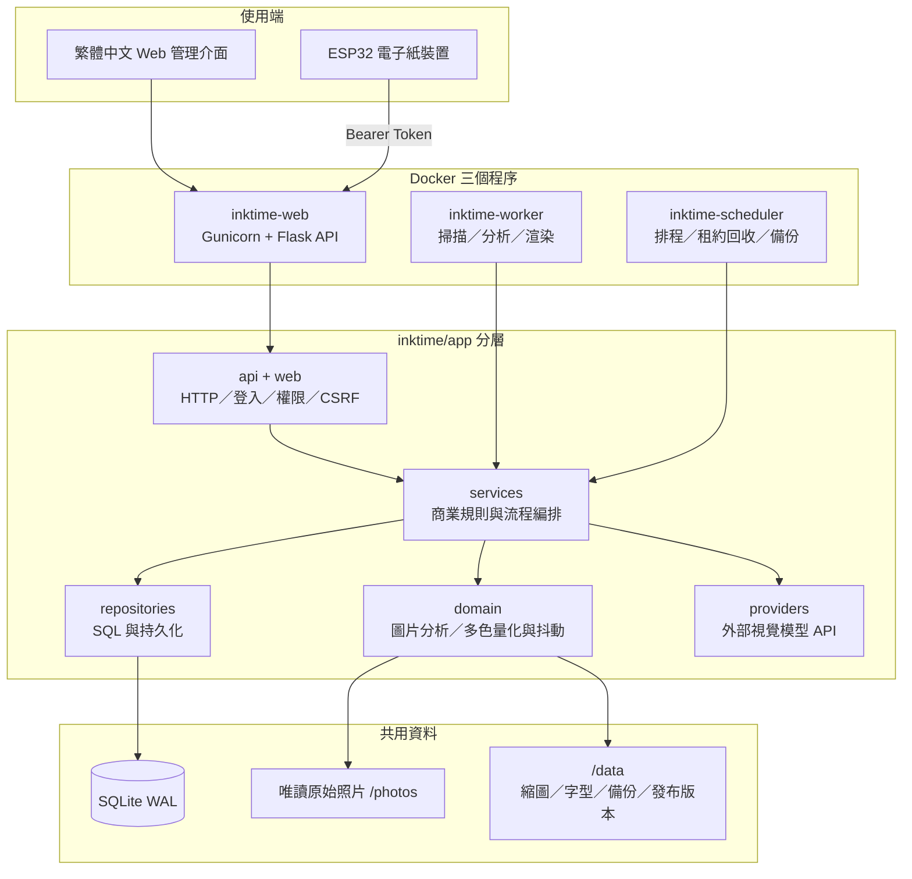

從哪個目錄開始看、照片如何從掃描走到模型評分與電子紙發布，請見 [專案架構與評分流程](docs/ARCHITECTURE_ZH_TW.md)。詳細分層邊界請見 [目標架構](docs/ARCHITECTURE_TARGET.md)；重構前證據在 [工程稽核](docs/PROJECT_AUDIT_ZH_TW.md)。

### 目錄入口

| 路徑 | 用途 |
|---|---|
| `server.py` | Web 正式入口，組裝新版平台與舊版相容層 |
| `inktime/app/api/` | Route、登入權限、HTTP 輸入輸出 |
| `inktime/app/services/` | 分析、成本、渲染、備份等流程 |
| `inktime/app/repositories/` | SQLite 查詢、設定與資料存取 |
| `inktime/app/providers/` | OpenAI／相容模型呼叫、重試與用量 |
| `inktime/app/domain/` | 不依賴 Flask 的圖片、Schema、日期與多色量化／抖動邏輯 |
| `inktime/app/workers/` | 背景 Worker、Scheduler 與掃描器 |
| `inktime/app/web/` | 繁中管理介面的模板與 CSS |
| `esp32/` | 電子紙裝置韌體 |
| `docs/` | 安裝、架構、管理、成本、安全與維運文件 |

## 完整程式流程圖：從啟動、照片分析到電子紙顯示

本節是 InkTime 的端到端程式地圖。圖中的圖示代表：👤 使用者、🌐 Web、⚙️ Worker、⏰ Scheduler、🧠 AI、🗃️ SQLite、🖼️ 照片／Renderer、📦 Release、📟 ESP32、🛡️ 安全檢查、💤 休眠。每張圖下方都列出實際程式入口，可依序追蹤程式碼。

### 0. 全系統主流程

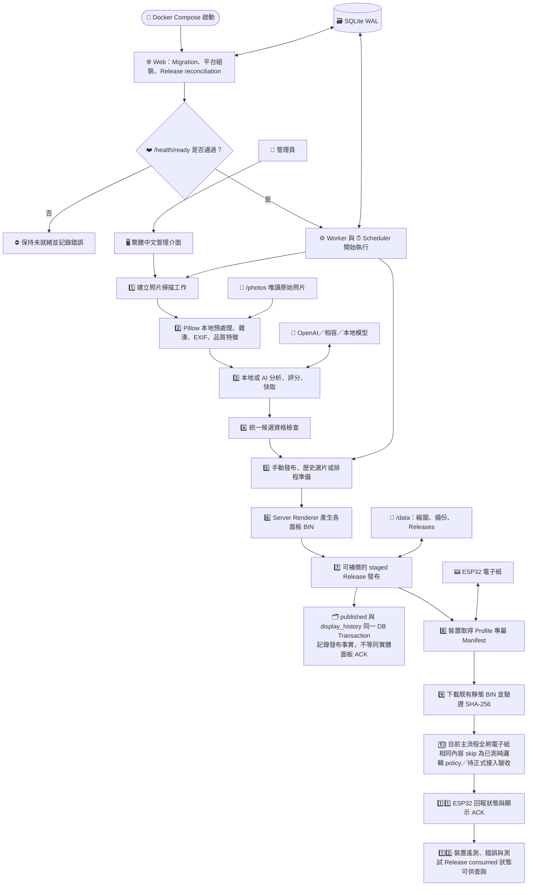

這條主線不代表所有工作都必須呼叫 AI：`local`、虛擬墨水屏與已命中分析／AI Cache 的路徑都可以完全不送出模型請求。

| 步驟 | 輸入 | 實際處理 | 成功輸出 | 主要程式入口 |
|---:|---|---|---|---|
| 1 | 管理員指定 Library Root | 建立可恢復的掃描 Job | `jobs`／`job_items` | `api/operations.py`、`repositories/jobs.py` |
| 2 | 唯讀照片檔案 | Pillow metadata、雜湊、本地品質與安全預篩 | `photos` 本地特徵與縮圖 Cache | `workers/scanner.py`、`domain/photos/preprocessing.py` |
| 3 | Photo ID、策略、預算與 Provider | 繼承、local、兩階段 AI、single-flight 與 Schema 驗證 | `photo_analysis`、AI Cache、用量 | `services/analysis.py` |
| 4 | 已分析照片 | 統一檢查 eligible、active、Library、最新分析、安全路徑與檔案存在 | 合格 Photo ID；明確指定失敗為 `RENDER-009` | `repositories/render_candidates.py` |
| 5 | 手動選片、歷史模式或 `display_prepare` | 年份、數量、Profile、偏好、fallback 與同日重抽 | 有序候選清單 | `services/display_prepare.py`、`services/rendering.py` |
| 6 | 照片、文案、版型與 Profile | Server 端 composition、字型覆蓋、調色盤、抖動與打包 | 480×800 BIN、Preview、Manifest | `domain/rendering/` |
| 7 | 一個或多個 staged Manifest | Validate、DB staged、pointer snapshot/activate、published/history、失敗補償 | Profile 專屬正式 Release ID | `services/release_coordinator.py` |
| 8 | ESP32 Bearer Token 與面板 Profile | 驗證 Token、裝置、Assignment、Profile 與 latest pointer | 裝置專屬 Manifest | `api/devices.py` |
| 9 | Manifest 指定檔名 | Server 驗路徑／Manifest／size／SHA；ESP32 再驗長度／SHA | 已驗證的靜態 Payload | `api/devices.py`、`esp32/ink-display-7C-photo/` |
| 10 | 已驗證 Payload、電源與面板狀態 | 六／七色完整刷新、BUSY timeout、失敗保留舊畫面 | 電子紙顯示結果 | `spectra6_73.cpp`、`.ino` |
| 11 | Release ID、SHA 驗證、display_updated、錯誤碼 | 保存裝置狀態；測試 Release 依 ACK 推進狀態機 | Device event／power sample／consumed assignment | `api/devices.py`、`domain/rendering/release.py` |
| 12 | Release 與裝置狀態 | Web 查詢歷史、診斷、成本、裝置與通知 | 可稽核的管理介面 | `api/`、`web/templates/` |

### 1. 三程序啟動、Migration 與健康檢查

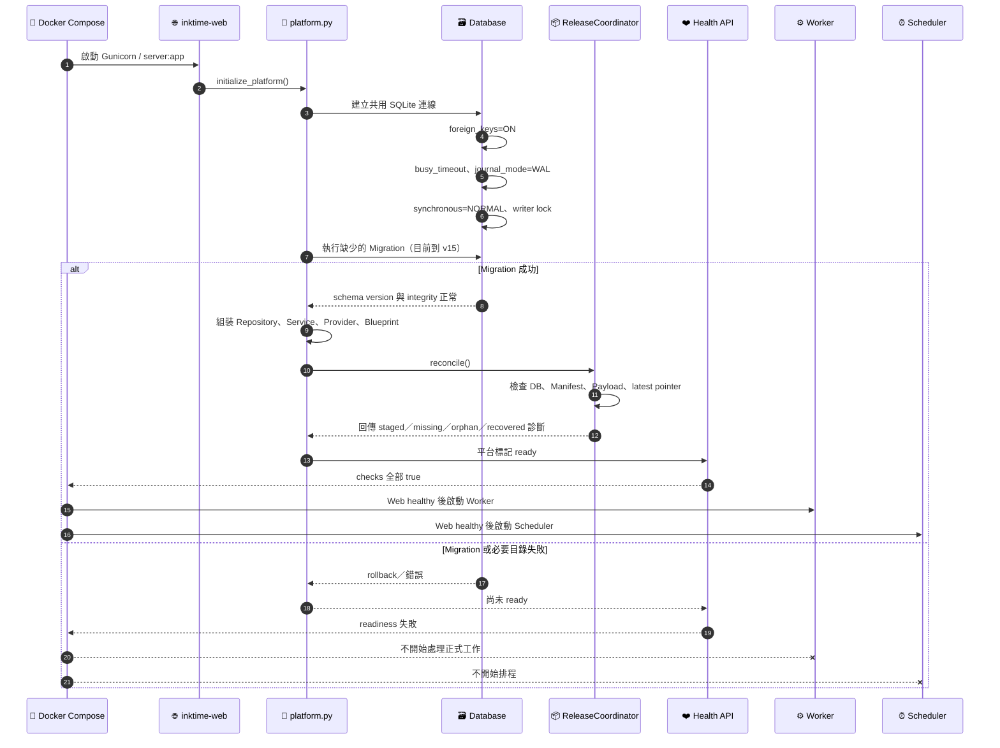

程式入口：`server.py` → `inktime/app/platform.py` → `inktime/app/db/connection.py`、`migrations.py` → `services/release_coordinator.py` → `api/health.py`。

### 2. 照片掃描與本地預處理生命週期

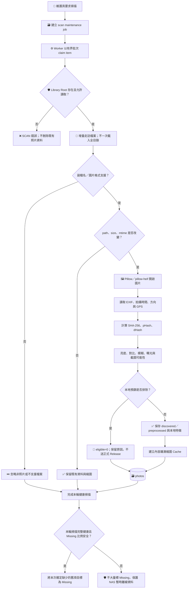

程式入口：`api/operations.py` → `workers/runner.py` → `workers/scanner.py` → `domain/photos/preprocessing.py` → `repositories/photos.py`。Metadata 全程使用 Pillow，不呼叫 ExifTool Shell。

### 3. 分析策略、AI Cache Single-Flight 與計費

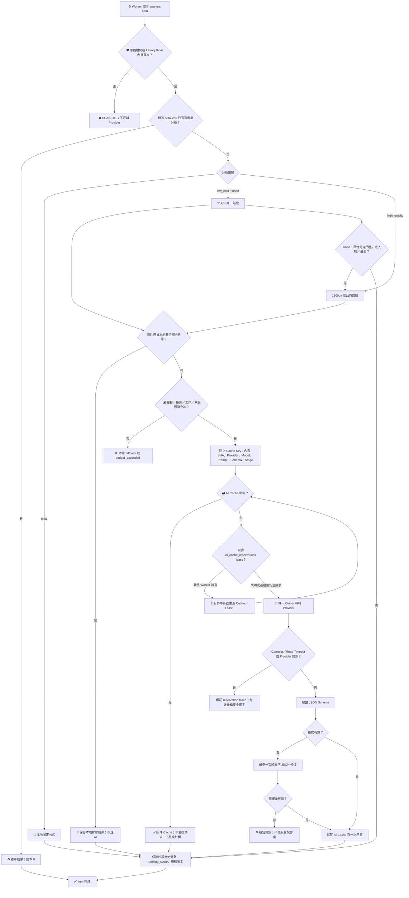

程式入口：`services/analysis.py` → `repositories/photos.py` → `providers/router.py`、`openai_compatible.py` → `domain/analysis/schema.py`、`scoring.py`。同一 Cache Key 的並行請求只有 Reservation Owner 能呼叫 Provider。

### 4. 統一候選照片資格判斷

一般正式發布、歷史選片、Top Ranked、同日重抽與排程都必須通過同一組資格；不因入口不同而放寬。

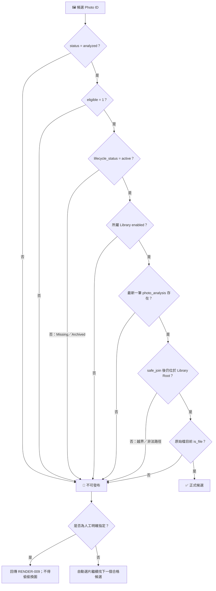

程式入口：`repositories/render_candidates.py`，由 `services/rendering.py` 與 `services/display_prepare.py` 共用。

### 5. 歷史選片與同日重抽

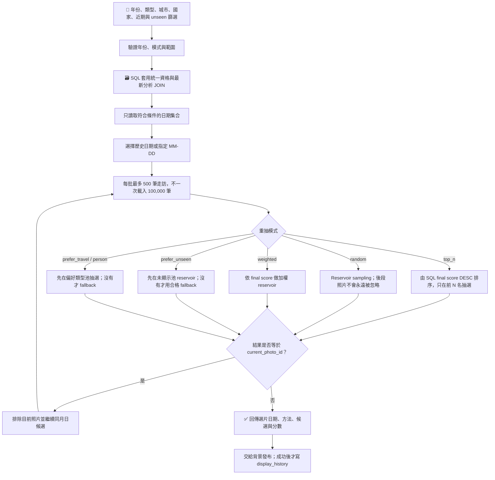

### 6. 排程設定如何真正進入 Worker

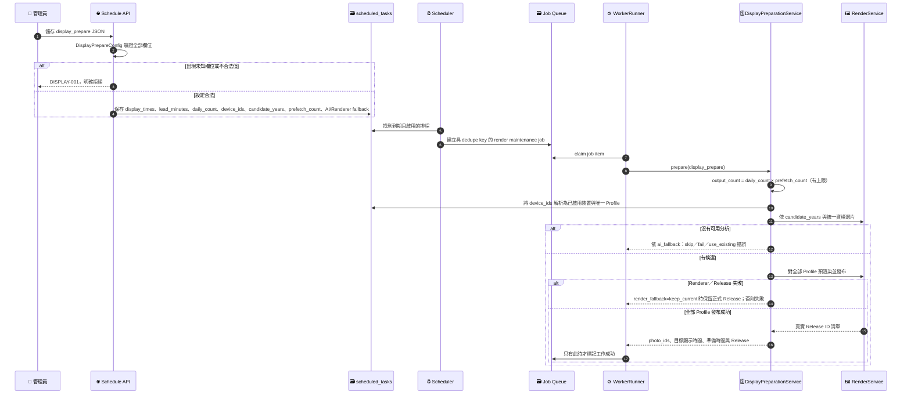

程式入口：`repositories/schedules.py` → `workers/scheduler.py` → `workers/runner.py` → `services/display_prepare.py` → `services/rendering.py`。

### 7. Server Renderer 與可補償的兩階段 Release

這是「檔案系統操作 + SQLite Transaction + 失敗補償」，不是跨檔案系統與 SQLite 的單一 ACID Transaction。

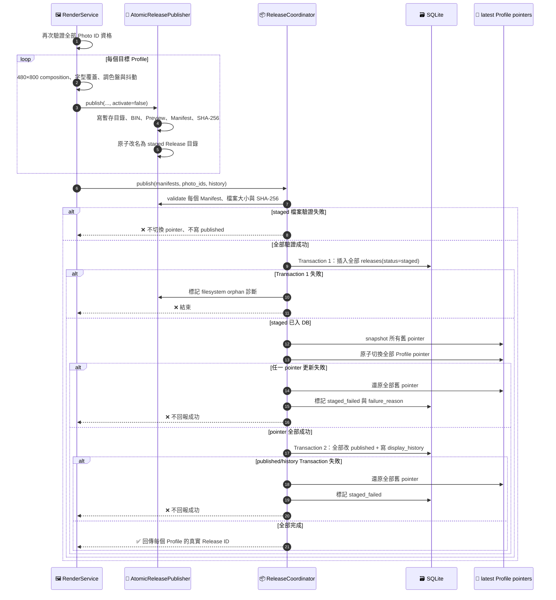

### 8. Worker 有界佇列、Timeout 與晚到結果

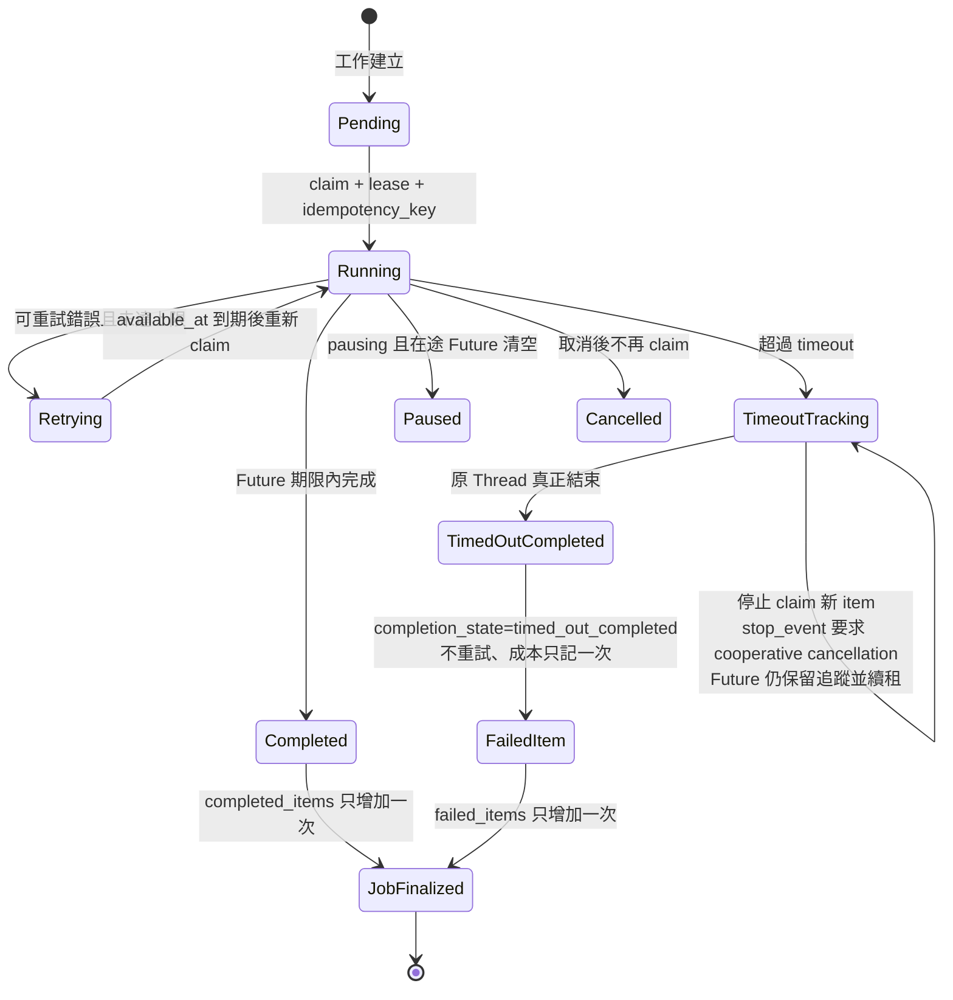

Worker 只維持 `concurrency × queue_multiplier` 個 Future。Python Thread 無法安全強制終止，因此 Timeout 後採「停止新增副作用、保留追蹤、等待實際結束、晚到結果只留診斷」；不全面改成 Process。

### 9. ESP32 正式 Release 與一次性裝置測試 Release

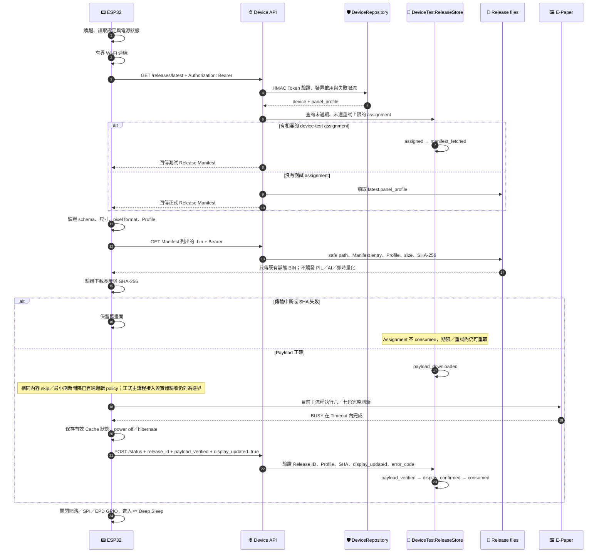

六／七色 Profile 明確為 `supports_partial_refresh=false`、`requires_full_refresh=true`。未有驅動與面板資料表證據前，不加入 Partial Refresh。

### 10. 備份、離線還原與 Release reconciliation

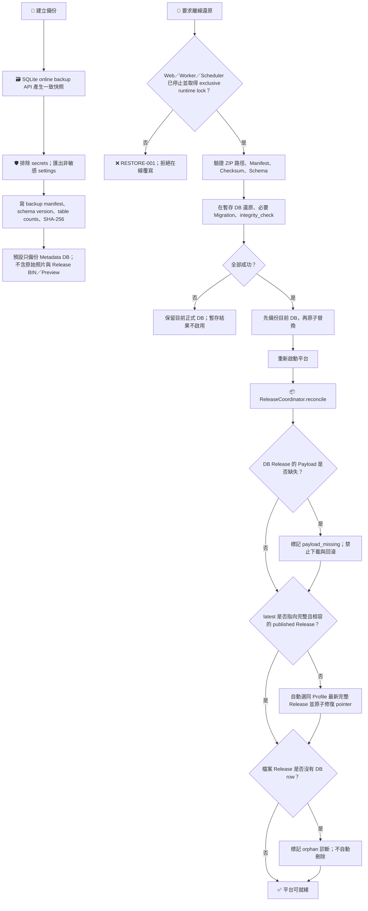

### 11. 核心資料關係

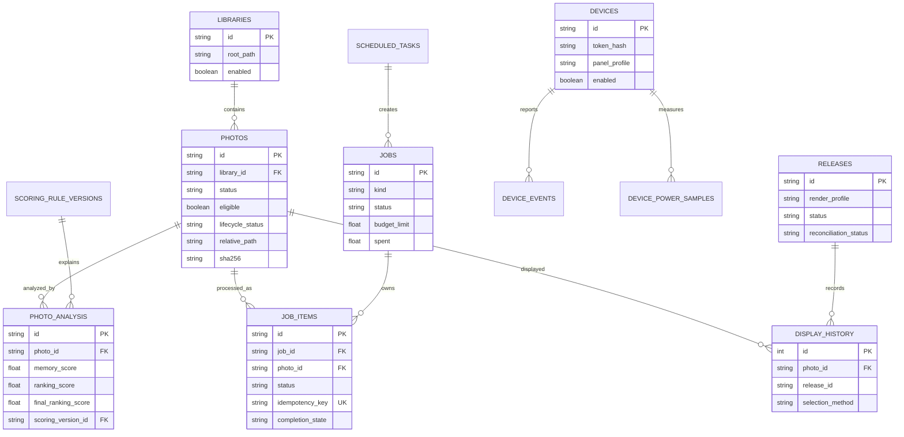

### 12. 安全與信任邊界

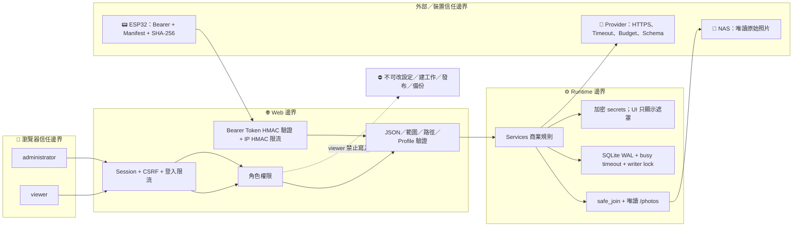

安全重點：Production 不使用 `os.system`、`os.popen`、`shell=True` 或 ExifTool Shell；裝置 API 只提供預先產生並驗證的靜態 Payload。Bearer Token 是認證而不是傳輸加密，HTTP 只適合隔離 IoT VLAN。

### 13. 失敗時系統保留什麼

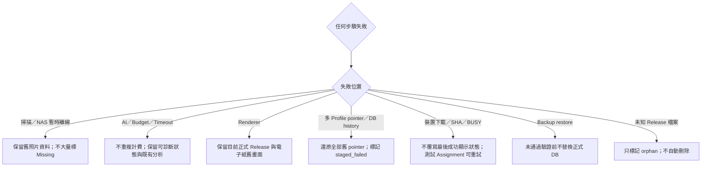

更細的錯誤碼與操作步驟請見[錯誤碼](docs/ERROR_CODES_ZH_TW.md)、[疑難排解](docs/TROUBLESHOOTING_ZH_TW.md)、[備份還原](docs/BACKUP_RESTORE_ZH_TW.md)與[最終跨模組稽核](docs/FINAL_CROSS_MODULE_HARDENING_REVIEW_ZH_TW.md)。

## Docker 快速安裝

需求：Docker Engine 24+ 與 Compose v2。先準備可寫資料目錄與唯讀照片目錄：

```bash
cp .env.example .env
# 預設已使用 ./simulation_photos；可再把 INKTIME_PHOTO_PATH 改成正式相簿路徑。
docker compose up -d --build
```

開啟 `http://主機IP:8765/`，首次啟動精靈會要求建立非空白的管理員密碼；系統不限制長度，但正式環境仍建議使用密碼管理器產生的長密碼。正式 HTTPS 反向代理請將 `INKTIME_COOKIE_SECURE=1`。

三個服務使用同一映像檔：

- `inktime-web`：Gunicorn 管理介面與裝置 API。
- `inktime-worker`：照片掃描、分析、重試與渲染工作。
- `inktime-scheduler`：租約回收、每日備份與保留策略。

完整 N100 資源上限、Volume 權限、健康檢查、HTTPS、更新與回滾見 [Docker 部署規格](docs/DOCKER_GUIDE_ZH_TW.md)。

## 首次使用

1. 建立管理員並登入。
2. 尚未準備模型或電子紙時，可將照片放進 `simulation_photos/`，到「維護」按「掃描並送到虛擬墨水屏」，再用獨立的 `/virtual-display` 接收正式 Manifest 與 BIN；這個流程不會呼叫模型。
3. 要啟用智慧選片時，到「模型」新增 OpenAI、OpenAI 相容或本地端點；API Key 加密儲存且只顯示遮罩。
4. 到「維護」輸入容器內照片路徑（Compose 預設 `/photos`），建立背景掃描工作。
5. 到「工作」建立兩階段智慧分析，確認照片數、Token、費用範圍與工作預算後啟動。
6. 到「渲染」預覽並選擇內建的手寫／文青繁中字型，測試渲染後發布 2bpp 版本；需要時仍可上傳其他字型。
7. 到「裝置」新增 ESP32；立即複製只顯示一次的 Token 到裝置 AP 設定頁。
8. 到「備份」建立並下載第一份備份。

## 歷史今日與安全換圖

「渲染」頁的「歷史今日／隨機一天」可依年份、人物／旅行／風景、城市、國家、近期顯示紀錄與未顯示狀態選擇歷史日期。候選一律要求為合格、非 Missing、非人工排除且原始檔目前可讀；沒有結果時會保留所有篩選條件並明確提示，不會改選被排除的照片。

選定日期後可同日重抽（跨年份），支援完全隨機、最終分數加權、前 N 名與人物／旅行偏好，且不會立刻抽回目前照片。正式 Release 會經由背景 Worker 與 Server Renderer 建立，完成後才寫入顯示歷史；「傳送到墨水屏測試」同樣由 Server Renderer 產生獨立 device-test Release，不覆寫正式排程。

## 不用修改程式碼的日常設定

一般、分析、Worker 待機、模型、成本、渲染、裝置、Log 層級、安全與備份設定都在「設定」頁。每次修改會記錄時間、使用者、來源 IP、舊值／新值摘要與生效方式；Secret 不會寫入歷史。只有 Volume、Port、映像、HTTPS 與 Docker cgroup／Log 輪替屬於一次性部署邊界。完整欄位、預設值、範圍與風險見 [管理指南](docs/ADMIN_GUIDE_ZH_TW.md)。

## 照片評分與模型調整在哪裡

管理介面的「設定」與「評分」頁可調整：

- `model.low_model`、`model.high_model`：第一、第二階段使用哪個模型。
- 「評分」頁：照片高低分規則、四項綜合排序權重、最愛加分、版本歷史與單張測試台。
- `analysis.stage_two_threshold`：第一階段的回憶分達到多少才升級到高品質分析；人物或最愛照片也會升級。
- `render.memory_threshold`：電子紙歷史今日選片的最低回憶分門檻。

四項模型原始分數 `memory_score`、`beauty_score`、`technical_quality_score`、`emotion_score` 永遠保留；系統另以版本化權重計算 `ranking_score`，預設為回憶 50%、美觀 20%、技術 10%、情緒 20%，最愛照片再加 5 分（最高 100）。新規則只影響之後的分析；每筆分析會記住使用的規則版本。測試台照片只在暫存目錄停留，但模型 Token 與費用仍會記入成本頁。完整資料流見 [專案架構與評分流程](docs/ARCHITECTURE_ZH_TW.md)。

## Token 與成本控制

建議預設使用「兩階段智慧分析」：512px 低成本初篩，只有回憶分數達門檻、人物或最愛照片才使用 1600px 高品質模型。相同 SHA-256 繼承既有結果；短文案與所有分數在同一階段圖片請求輸出。管理介面提供每日、每月、單工作與單張照片停止值。詳見 [Token 成本指南](docs/TOKEN_COST_GUIDE_ZH_TW.md)。

## ESP32 配對與可靠性

新版韌體不再把金鑰放在 URL。裝置先以 Bearer Token 取得專屬面板 Profile 的 Manifest，套用 Web 管理且帶版本的面板／時區／每日排程／旋轉，驗證尺寸與 SHA-256，成功才刷新；之後回報設定 ACK、firmware、RSSI、Heap／PSRAM 與最後錯誤。Scheduler 以低頻掃描建立離線／恢復通知，可選去重 Webhook。既有 EOL GDEY073D46 與新 GDEP073E01 有不同 compile profile；完整設定見[裝置可靠性與六／七色渲染指南](docs/DEVICE_COLOR_NOTIFICATION_GUIDE_ZH_TW.md)。

## 原生安裝與相容 CLI

需求為 Python 3.10+（正式映像使用 Python 3.12）：

```bash
python3 -m venv .venv
source .venv/bin/activate
pip install -r requirements.txt
python server.py                 # 僅本機開發
python -m inktime.app.workers.runner
```

正式環境不可使用 Flask Development Server；請使用 Docker 或 `gunicorn server:app`。舊 `analyze_photos.py` 命令仍可使用，但已改為建立新版持久化 Job；原單檔實作保存在 `legacy_analyze_photos.py` 供遷移比較，不建議執行。

## 安全注意事項

- 不要 Commit `.env`、`config.py`、資料庫、Session Key、API Key 或裝置 Token。
- 公網部署必須使用 HTTPS、Secure Cookie、反向代理限流與 NAS 最小權限。
- 舊 `/static/inktime/<key>/...` API 預設關閉；只有隔離網路短期遷移才可明確開啟。
- viewer 只能查看，不能修改設定、建立／控制工作、管理 Token、發布或備份。

詳見 [安全指南](docs/SECURITY_GUIDE_ZH_TW.md)與[錯誤碼](docs/ERROR_CODES_ZH_TW.md)。

## 更新、遷移與回滾

更新前先從介面建立備份，再拉取映像並執行 `docker compose up -d --build`。Migration 使用版本、狀態歷史、單一交易、升級前備份與完整 `integrity_check`；任何失敗或未完成狀態都會停止啟動。回滾時停止三個服務，使用離線還原工具驗證並原子恢復舊資料庫與映像。詳細步驟見 [遷移指南](docs/MIGRATION_GUIDE_ZH_TW.md)與[備份還原](docs/BACKUP_RESTORE_ZH_TW.md)。

## 常見問題

- 沒有照片：到「維護」確認容器路徑是 `/photos` 且 Volume 可讀。
- 工作不動：到「診斷」確認 Worker 與 Queue，再看「錯誤中心」。
- 模型結果無效：確認模型支援 JSON Schema；系統只修復一次，避免無限成本。
- 繁中變方框：到「渲染」確認已選取內建芫荽／霞鶩文楷 TC，或上傳涵蓋短文案所有字元的繁中字型；系統不會靜默改用 PIL 預設字型。
- 裝置 401：Token 已撤銷、輸入錯誤或裝置被停用；重新產生後需更新裝置。

更多處理方式見 [疑難排解](docs/TROUBLESHOOTING_ZH_TW.md)。效能證據見 [100,000 筆報告](docs/PERFORMANCE_REPORT.md)，最終完成邊界見 [實作報告](docs/FINAL_IMPLEMENTATION_REPORT_ZH_TW.md)。

## 正式發布與裝置安全邊界

- 一般發布、歷史選片與排程共用同一候選資格：已分析、可選、active、最新分析存在，而且原始檔仍位於啟用的 Library Root。
- Release 先產生 staged 檔案並驗證 Manifest／大小／SHA-256，再以補償式流程切換 Profile pointer、提交 DB 與 `display_history`。啟動時標記漂移，失效 pointer 可回復到同 Profile 最新完整版本，但不自動刪除未知 Release。
- 裝置仍使用 `Authorization: Bearer`；Bearer Token 不會加密 HTTP。HTTP 只適合隔離 IoT VLAN，跨網路必須使用已驗證 CA 的 HTTPS 或 VPN。
- 六／七色 Profile 明確宣告不支援 Partial Refresh；相同內容跳過刷新與最小刷新間隔仍須由正式韌體／實體面板完成驗收。
- 預設備份只有 Metadata DB，不含原始照片或 Release Payload。還原後會進行 Release reconciliation。

詳見[裝置傳輸安全](docs/DEVICE_TRANSPORT_SECURITY_ZH_TW.md)、[安全 OTA 設計](docs/SECURE_OTA_DESIGN_ZH_TW.md)與[最終跨模組稽核](docs/FINAL_CROSS_MODULE_HARDENING_REVIEW_ZH_TW.md)。

## 授權

本專案依原始儲存庫授權條款發布；ESP32 使用的第三方函式庫另依其授權。內建芫荽與霞鶩文楷 TC 均採 SIL Open Font License 1.1，授權全文與固定版本資訊隨字型資產附上。
