# InkTime｜照片分析與電子紙回憶管理平台

[English legacy README](README.en.md) · [專案規格與文件入口](USER_MANUAL.html) · [完整 Markdown 文件地圖](docs/README.md) · [完整程式流程圖](#完整程式流程圖從啟動照片分析到電子紙顯示) · [快速開始](docs/getting-started/QUICK_START_ZH_TW.md) · [電子紙模擬器](docs/guides/EPAPER_SIMULATOR_ZH_TW.md) · [N100 Docker 部署規格](docs/operations/DOCKER_GUIDE_ZH_TW.md) · [ESP32／電子紙指南](docs/devices/ESP32_GUIDE_ZH_TW.md) · [ESP32 自動配對與憑證](docs/devices/ESP32_AUTOMATIC_PAIRING_ZH_TW.md) · [Waveshare PhotoPainter](docs/devices/WAVESHARE_PHOTOPAINTER_ZH_TW.md) · [ESP32 TLS／配網信任根](docs/devices/ESP32_TLS_PROVISIONING_ZH_TW.md) · [OpenRouter Provider](docs/providers/OPENROUTER_ZH_TW.md) · [模型 Benchmark](docs/providers/MODEL_BENCHMARK_ZH_TW.md) · [資源與低功耗](docs/operations/N100_RESOURCE_GUIDE_ZH_TW.md) · [Log 指南](docs/operations/LOGGING_GUIDE_ZH_TW.md)

InkTime 會在本地掃描相簿、擷取 EXIF 與品質特徵，先去除重複與低價值照片，再以可控預算的視覺模型產生繁體中文描述、分類、分數與電子紙短文案。所有工作、模型、成本、裝置、渲染、備份與診斷都能由登入後的 Web 管理介面操作。

決策追蹤、回饋閉環、Shadow Mode、離線內容 Queue、資料保留與 Canary 發布皆為可選功能，預設不會改變既有配對裝置、正式 Release 或選片。啟用與故障處理請見 [實作計畫](docs/resilience/DECISION_FEEDBACK_RESILIENCE_PLAN_ZH_TW.md)、[決策追蹤](docs/resilience/DECISION_TRACE_ZH_TW.md)、[Shadow Mode](docs/resilience/SHADOW_MODE_ZH_TW.md)、[離線 Queue](docs/resilience/OFFLINE_QUEUE_ZH_TW.md)、[資料保留](docs/resilience/DATA_RETENTION_ZH_TW.md)、[Canary](docs/resilience/CANARY_ROLLOUT_ZH_TW.md)。

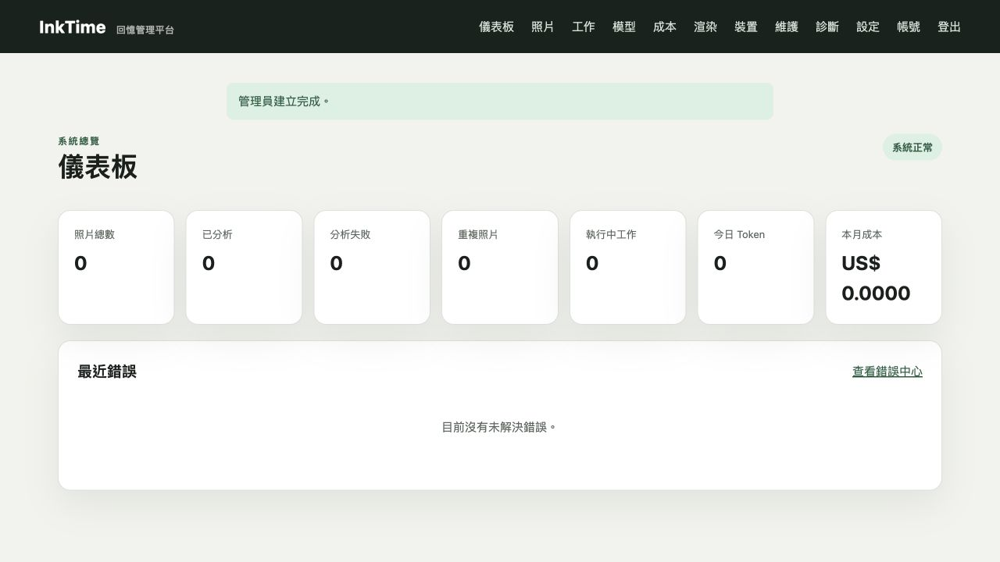

## 主要能力

- 以 SHA-256、pHash、dHash、EXIF、亮度、對比、模糊與曝光做本地預處理；相同內容不重複呼叫模型。
- 512／1024／1600px 內容雜湊縮圖快取；預設不傳原始 4K／8K 圖片。
- 單一分析請求同時回傳描述、類型、四種分數、短文案與敏感判斷；JSON 最多純文字修復一次。
- 正式 OpenRouter Provider contract：受控 routing／privacy options、reasoning 與 session routing；OpenRouter 不進入 InkTime Batch 路徑。完整設定見 [OpenRouter Provider 文件](docs/providers/OPENROUTER_ZH_TW.md)。
- 每筆 usage 區分 `provider_reported`／`estimated`／`unknown`；unknown 不會被當作 US$0，預算與新請求採 fail-closed。Token、cache 與 request-size 指標見 [Token 與成本指南](docs/reference/TOKEN_COST_GUIDE_ZH_TW.md)。
- 提供預設 offline、bounded、可重現的 [模型 Benchmark](docs/providers/MODEL_BENCHMARK_ZH_TW.md)；不會修改 production DB、analysis、release 或 AI cache。
- 支援同步 Vision 與 OpenAI Batch。OpenAI Files Batch lifecycle 已接入背景工作，支援 JSONL preparation、upload、submission、poll、result import 與 remote cleanup；同時支援 `upload_unknown`／`submission_unknown` 人工 Recovery、Cancel／Abandon、CAS、lease、attempt identity，以及 Job／Batch／Item transaction invariants。Fake lifecycle 與 CI 已覆蓋；真實 OpenAI API live smoke 仍為 `NOT RUN`，正式啟用前應先用 1–3 張非敏感圖片進行 gated live smoke。完整操作見 [OpenAI Batch 照片分析指南](docs/OPENAI_BATCH_ANALYSIS_ZH_TW.md)。
- 持久化 Job、逐張狀態、有界佇列、暫停、續跑、取消、失敗重跑、重啟恢復與成本停止線。
- administrator／viewer、Session、CSRF、登入限制與每台 ESP32 的自動配對 Device Secret；既有 Legacy Bearer Token 與 PhotoPainter Stock 相容模式分流保留。
- 480×800 四色 2bpp 與完整六／七色 indexed4 版本化發布；OKLab／RGB 色差、五種抖動、Profile 獨立 latest、SHA-256 與回滾。
- 裝置設定版本 ACK、離線／恢復站內通知、去重／冷卻與三次持久化 Webhook 重試。
- 繁體中文管理介面、動態 Log 層級、節流進度、錯誤中心、程序／cgroup／SQLite／Worker 診斷與已遮蔽診斷包。
- Intel N100 低資源預設：單 Web worker、圖片特徵最大 512px 樣本、有界 Future、15 秒閒置輪詢與容器 CPU／RAM／PID 上限。

正式部署採 loopback bind、Secure cookie、HTTPS public URL 與禁止 insecure HTTP；本機開發請明確使用 [`docker-compose.dev.yml`](docker-compose.dev.yml)。ESP32 backend transport 需要 trust anchor，配網密碼為隨機且在 portal／裝置畫面顯示；實體板、正式 NAS、真實 OpenRouter／OpenAI API 驗證仍標記 `NOT RUN`，交接詳見 [Production readiness handoff](docs/PRODUCTION_READINESS_SECURITY_HANDOFF_ZH_TW.md)。

## 架構

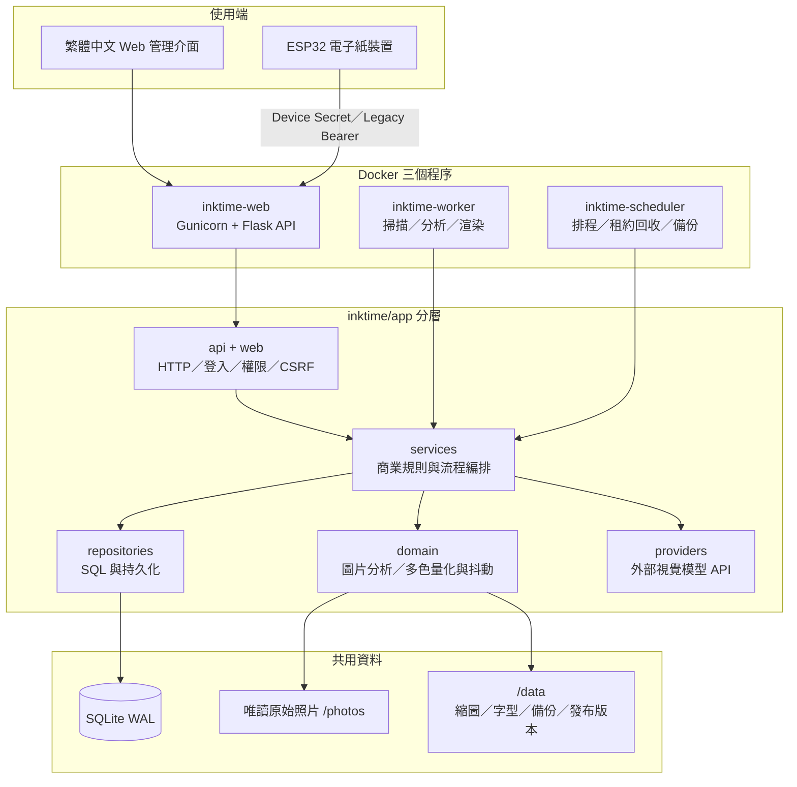
```mermaid
flowchart TB
    subgraph clients["使用端"]
        UI["繁體中文 Web 管理介面"]
        ESP["ESP32 電子紙裝置"]
    end

    subgraph processes["Docker 三個程序"]
        WEB["inktime-web<br/>Gunicorn + Flask API"]
        WORKER["inktime-worker<br/>掃描／分析／渲染"]
        SCHED["inktime-scheduler<br/>排程／租約回收／備份"]
    end

    subgraph application["inktime/app 分層"]
        API["api + web<br/>HTTP／登入／權限／CSRF"]
        SVC["services<br/>商業規則與流程編排"]
        DOMAIN["domain<br/>圖片分析／多色量化與抖動"]
        REPO["repositories<br/>SQL 與持久化"]
        PROVIDER["providers<br/>外部視覺模型 API"]
    end

    subgraph storage["共用資料"]
        DB[("SQLite WAL")]
        PHOTOS["唯讀原始照片 /photos"]
        DATA["/data<br/>縮圖／字型／備份／發布版本"]
    end

    UI --> WEB --> API --> SVC
    ESP -->|"Device Secret／Legacy Bearer"| WEB
    WORKER --> SVC
    SCHED --> SVC
    SVC --> DOMAIN
    SVC --> PROVIDER
    SVC --> REPO --> DB
    DOMAIN --> PHOTOS
    DOMAIN --> DATA
```

從哪個目錄開始看、照片如何從掃描走到模型評分與電子紙發布，請見 [專案架構與評分流程](docs/architecture/ARCHITECTURE_ZH_TW.md)。詳細分層邊界請見 [目標架構](docs/architecture/ARCHITECTURE_TARGET.md)；重構前證據已歸檔於 [工程稽核](docs/archive/baselines/PROJECT_AUDIT_ZH_TW.md)。

### 目錄入口

| 路徑 | 用途 |
|---|---|
| `server.py` | Web 正式入口，呼叫 Application Factory；Legacy 相容層預設關閉 |
| `inktime/app/api/` | Route、登入權限、HTTP 輸入輸出 |
| `inktime/app/services/` | 分析、成本、渲染、備份等流程 |
| `inktime/app/repositories/` | SQLite 查詢、設定與資料存取 |
| `inktime/app/providers/` | OpenAI／相容模型呼叫、重試與用量 |
| `inktime/app/domain/` | 不依賴 Flask 的圖片、Schema、日期與多色量化／抖動邏輯 |
| `inktime/app/workers/` | 背景 Worker、Scheduler 與掃描器 |
| `inktime/app/web/` | 繁中管理介面的模板與 CSS |
| `esp32/` | 電子紙裝置韌體 |
| `docs/` | 安裝、架構、管理、成本、安全與維運文件 |

## 完整程式流程圖：從啟動、照片分析到電子紙顯示

本節是 InkTime 的端到端程式地圖。圖中的圖示代表：👤 使用者、🌐 Web、⚙️ Worker、⏰ Scheduler、🧠 AI、🗃️ SQLite、🖼️ 照片／Renderer、📦 Release、📟 ESP32、🛡️ 安全檢查、💤 休眠。每張圖下方都列出實際程式入口，可依序追蹤程式碼。

### 0. 全系統主流程

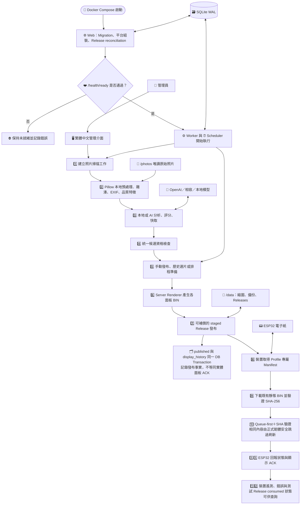
```mermaid
flowchart TD
    START(["🚀 Docker Compose 啟動"]) --> WEB["🌐 Web：Migration、平台組裝、Release reconciliation"]
    WEB --> READY{"❤️ /health/ready 是否通過？"}
    READY -->|否| STOP["⛔ 保持未就緒並記錄錯誤"]
    READY -->|是| PROCESSES["⚙️ Worker 與 ⏰ Scheduler 開始執行"]

    USER["👤 管理員"] --> UI["🖥️ 繁體中文管理介面"]
    UI --> SCAN["1️⃣ 建立照片掃描工作"]
    SCAN --> PREPROCESS["2️⃣ Pillow 本地預處理、雜湊、EXIF、品質特徵"]
    PREPROCESS --> ANALYZE["3️⃣ 本地或 AI 分析、評分、快取"]
    ANALYZE --> ELIGIBLE["4️⃣ 統一候選資格檢查"]
    ELIGIBLE --> SCHEDULE["5️⃣ 手動發布、歷史選片或排程準備"]
    SCHEDULE --> RENDER["6️⃣ Server Renderer 產生各面板 BIN"]
    RENDER --> RELEASE["7️⃣ 可補償的 staged Release 發布"]
    RELEASE --> HISTORY["🗂️ published 與 display_history 同一 DB Transaction<br/>記錄發布事實，不等同實體面板 ACK"]
    RELEASE --> MANIFEST["8️⃣ 裝置取得 Profile 專屬 Manifest"]
    MANIFEST --> DOWNLOAD["9️⃣ 下載既有靜態 BIN 並驗證 SHA-256"]
    DOWNLOAD --> DISPLAY["🔟 Queue-first＋SHA 驗證<br/>相同內容由正式韌體安全跳過刷新"]
    DISPLAY --> ACK["1️⃣1️⃣ ESP32 回報狀態與顯示 ACK"]
    ACK --> TELEMETRY["1️⃣2️⃣ 裝置遙測、錯誤與測試 Release consumed 狀態可供查詢"]

    PROCESSES --> SCAN
    PROCESSES --> SCHEDULE
    DB[("🗃️ SQLite WAL")] <--> WEB
    DB <--> PROCESSES
    PHOTOS["📁 /photos 唯讀原始照片"] --> PREPROCESS
    DATA["📁 /data：縮圖、備份、Releases"] <--> RELEASE
    MODEL["🧠 OpenAI／相容／本地模型"] <--> ANALYZE
    DEVICE["📟 ESP32 電子紙"] <--> MANIFEST
```

這條主線不代表所有工作都必須呼叫 AI：`local`、虛擬墨水屏與已命中分析／AI Cache 的路徑都可以完全不送出模型請求。

| 步驟 | 輸入 | 實際處理 | 成功輸出 | 主要程式入口 |
|---:|---|---|---|---|
| 1 | 管理員指定 Library Root | 建立可恢復的掃描 Job | `jobs`／`job_items` | `api/operations.py`、`repositories/jobs.py` |
| 2 | 唯讀照片檔案 | Pillow metadata、雜湊、本地品質與安全預篩 | `photos` 本地特徵與縮圖 Cache | `workers/scanner.py`、`domain/photos/preprocessing.py` |
| 3 | Photo ID、策略、預算與 Provider | 繼承、local、兩階段 AI、single-flight 與 Schema 驗證 | `photo_analysis`、AI Cache、用量 | `services/analysis.py` |
| 4 | 已分析照片 | 統一檢查 eligible、active、Library、最新分析、安全路徑與檔案存在 | 合格 Photo ID；明確指定失敗為 `RENDER-009` | `repositories/render_candidates.py` |
| 5 | 手動選片、歷史模式或 `display_prepare` | 年份、數量、Profile、偏好、fallback 與同日重抽 | 有序候選清單 | `services/display_prepare.py`、`services/rendering.py` |
| 6 | 照片、文案、版型與 Profile | Server 端 composition、字型覆蓋、調色盤、抖動與打包 | 480×800 BIN、Preview、Manifest | `domain/rendering/` |
| 7 | 一個或多個 staged Manifest | Validate、DB staged、pointer snapshot/activate、published/history、失敗補償 | Profile 專屬正式 Release ID | `services/release_coordinator.py` |
| 8 | ESP32 自動配對／Legacy Bearer 與面板 Profile | 驗證 Device Secret 版本或 Legacy Token、裝置、Assignment、Profile 與 latest pointer | 裝置專屬 Manifest | `api/device_pairing.py`、`api/devices.py` |
| 9 | Manifest 指定檔名 | Server 驗路徑／Manifest／size／SHA；ESP32 再驗長度／SHA | 已驗證的靜態 Payload | `api/devices.py`、`esp32/ink-display-7C-photo/` |
| 10 | 已驗證 Payload、電源與面板狀態 | 六／七色完整刷新、BUSY timeout、失敗保留舊畫面 | 電子紙顯示結果 | `spectra6_73.cpp`、`.ino` |
| 11 | Release ID、SHA 驗證、display_updated、錯誤碼 | 保存裝置狀態；測試 Release 依 ACK 推進狀態機 | Device event／power sample／consumed assignment | `api/devices.py`、`domain/rendering/release.py` |
| 12 | Release 與裝置狀態 | Web 查詢歷史、診斷、成本、裝置與通知 | 可稽核的管理介面 | `api/`、`web/templates/` |

### 1. 三程序啟動、Migration 與健康檢查

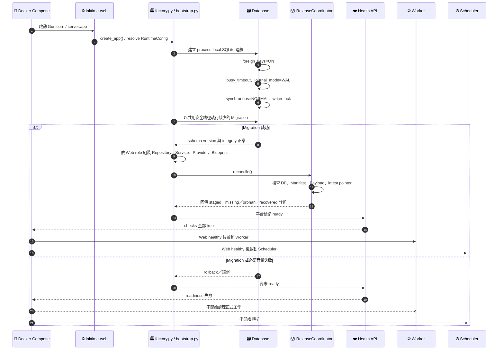
```mermaid
sequenceDiagram
    autonumber
    participant C as 🚀 Docker Compose
    participant W as 🌐 inktime-web
    participant F as 🏭 factory.py / bootstrap.py
    participant D as 🗃️ Database
    participant R as 📦 ReleaseCoordinator
    participant H as ❤️ Health API
    participant B as ⚙️ Worker
    participant S as ⏰ Scheduler

    C->>W: 啟動 Gunicorn / server:app
    W->>F: create_app() / resolve RuntimeConfig
    F->>D: 建立 process-local SQLite 連線
    D->>D: foreign_keys=ON
    D->>D: busy_timeout、journal_mode=WAL
    D->>D: synchronous=NORMAL、writer lock
    F->>D: 以共用安全路徑執行缺少的 Migration
    alt Migration 成功
        D-->>F: schema version 與 integrity 正常
        F->>F: 依 Web role 組裝 Repository、Service、Provider、Blueprint
        F->>R: reconcile()
        R->>R: 檢查 DB、Manifest、Payload、latest pointer
        R-->>F: 回傳 staged／missing／orphan／recovered 診斷
        F->>H: 平台標記 ready
        H-->>C: checks 全部 true
        C->>B: Web healthy 後啟動 Worker
        C->>S: Web healthy 後啟動 Scheduler
    else Migration 或必要目錄失敗
        D-->>F: rollback／錯誤
        F-->>H: 尚未 ready
        H-->>C: readiness 失敗
        C--xB: 不開始處理正式工作
        C--xS: 不開始排程
    end
```

程式入口：`server.py` → `inktime/app/factory.py` → `inktime/app/bootstrap.py` → `inktime/app/db/connection.py`、`migrations.py` → `services/release_coordinator.py` → `api/health.py`。Worker／Scheduler 使用同一 RuntimeConfig 與 Bootstrap，但不 import `server:app` 或載入 Web Template。

### 2. 照片掃描與本地預處理生命週期

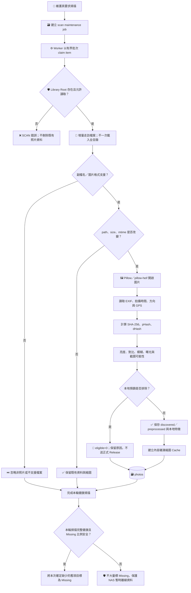
```mermaid
flowchart TD
    REQUEST["👤 維護頁要求掃描"] --> JOB["🗃️ 建立 scan maintenance job"]
    JOB --> CLAIM["⚙️ Worker 以有界批次 claim item"]
    CLAIM --> ROOT{"🛡️ Library Root 存在且允許讀取？"}
    ROOT -->|否| SCAN_ERROR["❌ SCAN 錯誤；不刪除既有照片資料"]
    ROOT -->|是| WALK["📁 增量走訪檔案；不一次載入全目錄"]
    WALK --> TYPE{"副檔名／圖片格式支援？"}
    TYPE -->|否| SKIP["⏭️ 忽略非照片或不支援檔案"]
    TYPE -->|是| CHANGED{"path、size、mtime 是否改變？"}
    CHANGED -->|否| KEEP["✅ 保留既有資料與縮圖"]
    CHANGED -->|是| PILLOW["🖼️ Pillow／pillow-heif 開啟圖片"]
    PILLOW --> META["讀取 EXIF、拍攝時間、方向與 GPS"]
    META --> HASH["計算 SHA-256、pHash、dHash"]
    HASH --> QUALITY["亮度、對比、模糊、曝光與截圖可能性"]
    QUALITY --> PREFILTER{"本地預篩是否排除？"}
    PREFILTER -->|是| EXCLUDED["🚫 eligible=0；保留原因，不送正式 Release"]
    PREFILTER -->|否| STORED["✅ 保存 discovered／preprocessed 與本地特徵"]
    STORED --> THUMB["建立內容雜湊縮圖 Cache"]
    EXCLUDED --> DB[("🗃️ photos")]
    THUMB --> DB
    KEEP --> COMPLETE["完成本輪健康掃描"]
    SKIP --> COMPLETE
    DB --> COMPLETE
    COMPLETE --> MISSING{"本輪掃描完整健康且 Missing 比例安全？"}
    MISSING -->|是| MARK["將本次確定缺少的舊項目標為 Missing"]
    MISSING -->|否| PRESERVE["🛡️ 不大量標 Missing，保護 NAS 暫時離線資料"]
```

程式入口：`api/operations.py` → `workers/runner.py` → `workers/scanner.py` → `domain/photos/preprocessing.py` → `repositories/photos.py`。Metadata 全程使用 Pillow，不呼叫 ExifTool Shell。

### 3. 分析策略、AI Cache Single-Flight 與計費

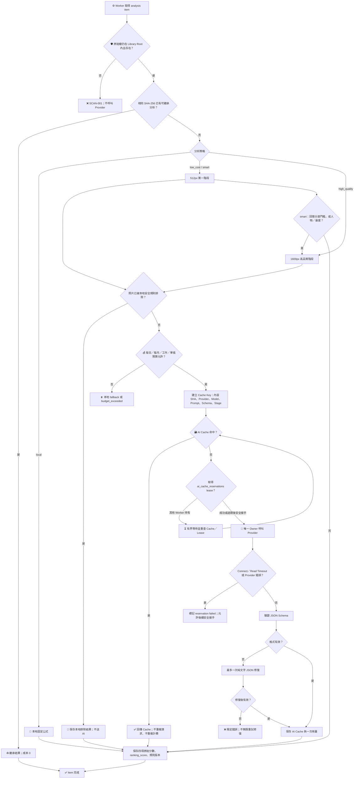
```mermaid
flowchart TD
    ITEM["⚙️ Worker 取得 analysis item"] --> PATH{"🛡️ 原始檔仍在 Library Root 內且存在？"}
    PATH -->|否| FAIL_FILE["❌ SCAN-001；不呼叫 Provider"]
    PATH -->|是| INHERIT{"相同 SHA-256 已有可繼承分析？"}
    INHERIT -->|是| COPY["♻️ 繼承結果；成本 0"]
    INHERIT -->|否| STRATEGY{"分析策略"}
    STRATEGY -->|local| LOCAL["🧮 本地固定公式"]
    STRATEGY -->|low_cost / smart| LOW["512px 第一階段"]
    STRATEGY -->|high_quality| HIGH["1600px 高品質階段"]

    LOW --> PREFILTER{"照片已被本地安全規則排除？"}
    HIGH --> PREFILTER
    PREFILTER -->|是| LOCAL_ONLY["🚫 保存本地排除結果；不送 AI"]
    PREFILTER -->|否| BUDGET{"💰 每日／每月／工作／單張預算允許？"}
    BUDGET -->|否| BUDGET_STOP["⏸️ 本地 fallback 或 budget_exceeded"]
    BUDGET -->|是| KEY["建立 Cache Key：內容 SHA、Provider、Model、Prompt、Schema、Stage"]
    KEY --> HIT{"🗃️ AI Cache 命中？"}
    HIT -->|是| CACHE["✅ 回傳 Cache；不重複請求、不重複計費"]
    HIT -->|否| RESERVE{"取得 ai_cache_reservations lease？"}
    RESERVE -->|其他 Worker 持有| WAIT["⏳ 有界等待並重查 Cache／Lease"]
    WAIT --> HIT
    RESERVE -->|成功或過期後安全接手| CALL["🧠 唯一 Owner 呼叫 Provider"]
    CALL --> TIMEOUT{"Connect／Read Timeout 或 Provider 錯誤？"}
    TIMEOUT -->|是| RELEASE_RESERVATION["標記 reservation failed；允許後續安全接手"]
    TIMEOUT -->|否| JSON["驗證 JSON Schema"]
    JSON --> VALID{"格式有效？"}
    VALID -->|否| REPAIR["最多一次純文字 JSON 修復"]
    REPAIR --> VALID2{"修復後有效？"}
    VALID2 -->|否| MODEL_FAIL["❌ 穩定錯誤；不無限重試修復"]
    VALID2 -->|是| PUT_CACHE["保存 AI Cache 與一次用量"]
    VALID -->|是| PUT_CACHE
    PUT_CACHE --> SCORE["保存四項原始分數、ranking_score、規則版本"]
    LOW --> GATE{"smart：回憶分達門檻，或人物／最愛？"}
    GATE -->|是| HIGH
    GATE -->|否| SCORE
    LOCAL --> SCORE
    LOCAL_ONLY --> SCORE
    COPY --> DONE["✅ Item 完成"]
    CACHE --> SCORE
    SCORE --> DONE
```

程式入口：`services/analysis.py` → `repositories/photos.py` → `providers/router.py`、`openai_compatible.py` → `domain/analysis/schema.py`、`scoring.py`。同一 Cache Key 的並行請求只有 Reservation Owner 能呼叫 Provider。

### 4. 統一候選照片資格判斷

一般正式發布、歷史選片、Top Ranked、同日重抽與排程都必須通過同一組資格；不因入口不同而放寬。

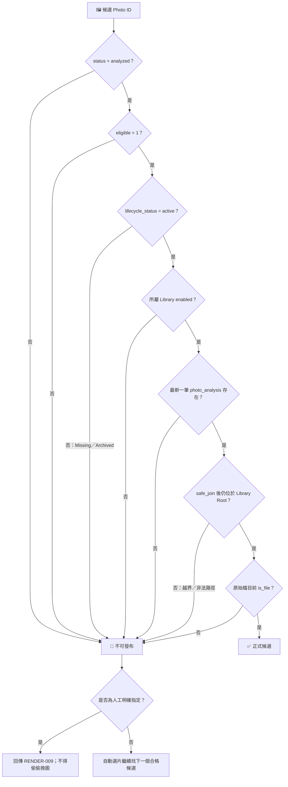
```mermaid
flowchart TD
    CANDIDATE["🖼️ 候選 Photo ID"] --> S1{"status = analyzed？"}
    S1 -->|否| REJECT["🚫 不可發布"]
    S1 -->|是| S2{"eligible = 1？"}
    S2 -->|否| REJECT
    S2 -->|是| S3{"lifecycle_status = active？"}
    S3 -->|否：Missing／Archived| REJECT
    S3 -->|是| S4{"所屬 Library enabled？"}
    S4 -->|否| REJECT
    S4 -->|是| S5{"最新一筆 photo_analysis 存在？"}
    S5 -->|否| REJECT
    S5 -->|是| S6{"safe_join 後仍位於 Library Root？"}
    S6 -->|否：越界／非法路徑| REJECT
    S6 -->|是| S7{"原始檔目前 is_file？"}
    S7 -->|否| REJECT
    S7 -->|是| ACCEPT["✅ 正式候選"]

    REJECT --> EXPLICIT{"是否為人工明確指定？"}
    EXPLICIT -->|是| ERROR["回傳 RENDER-009；不得偷偷換圖"]
    EXPLICIT -->|否| CONTINUE["自動選片繼續找下一個合格候選"]
```

程式入口：`repositories/render_candidates.py`，由 `services/rendering.py` 與 `services/display_prepare.py` 共用。

### 5. 歷史選片與同日重抽

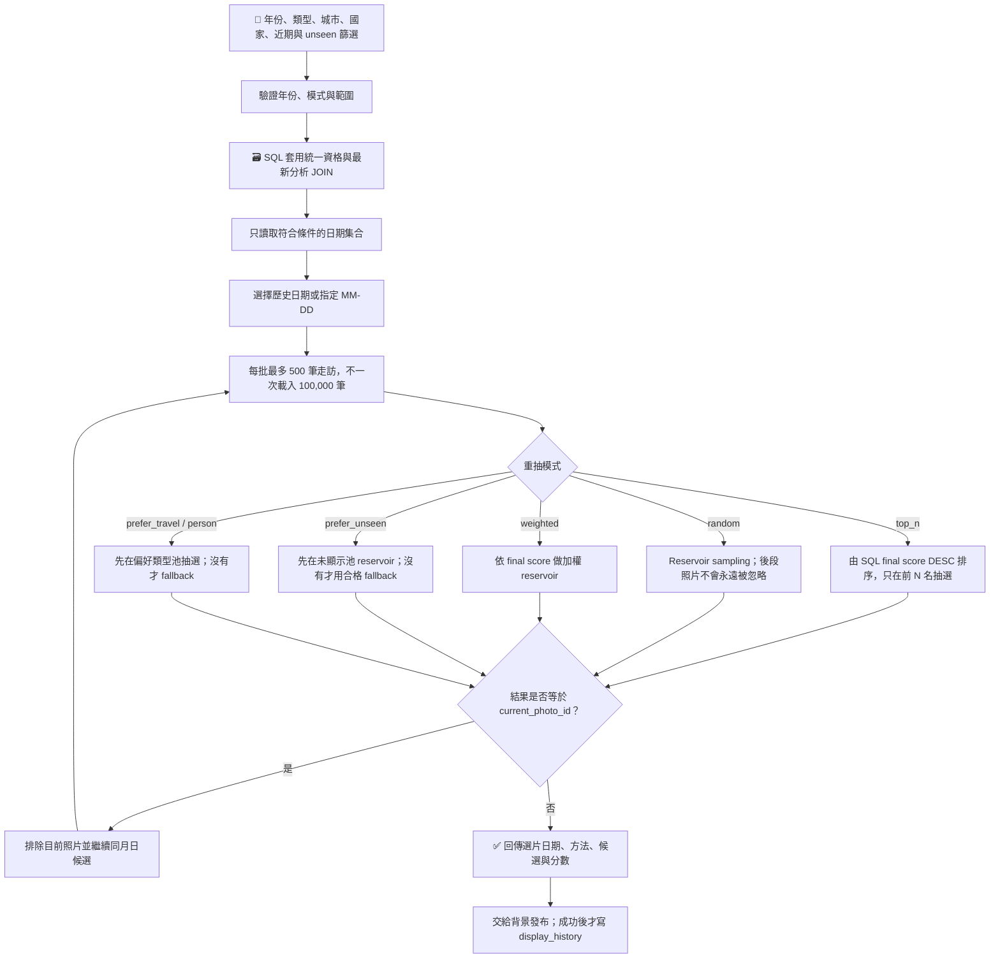
```mermaid
flowchart TD
    FILTER["👤 年份、類型、城市、國家、近期與 unseen 篩選"] --> VALIDATE["驗證年份、模式與範圍"]
    VALIDATE --> SQL["🗃️ SQL 套用統一資格與最新分析 JOIN"]
    SQL --> DATES["只讀取符合條件的日期集合"]
    DATES --> PICK_DAY["選擇歷史日期或指定 MM-DD"]
    PICK_DAY --> STREAM["每批最多 500 筆走訪，不一次載入 100,000 筆"]
    STREAM --> MODE{"重抽模式"}
    MODE -->|top_n| TOP["由 SQL final score DESC 排序，只在前 N 名抽選"]
    MODE -->|random| RANDOM["Reservoir sampling；後段照片不會永遠被忽略"]
    MODE -->|weighted| WEIGHT["依 final score 做加權 reservoir"]
    MODE -->|prefer_unseen| UNSEEN["先在未顯示池 reservoir；沒有才用合格 fallback"]
    MODE -->|prefer_travel / person| PREFER["先在偏好類型池抽選；沒有才 fallback"]
    TOP --> CURRENT{"結果是否等於 current_photo_id？"}
    RANDOM --> CURRENT
    WEIGHT --> CURRENT
    UNSEEN --> CURRENT
    PREFER --> CURRENT
    CURRENT -->|是| NEXT["排除目前照片並繼續同月日候選"]
    NEXT --> STREAM
    CURRENT -->|否| RESULT["✅ 回傳選片日期、方法、候選與分數"]
    RESULT --> PUBLISH["交給背景發布；成功後才寫 display_history"]
```

### 6. 排程設定如何真正進入 Worker

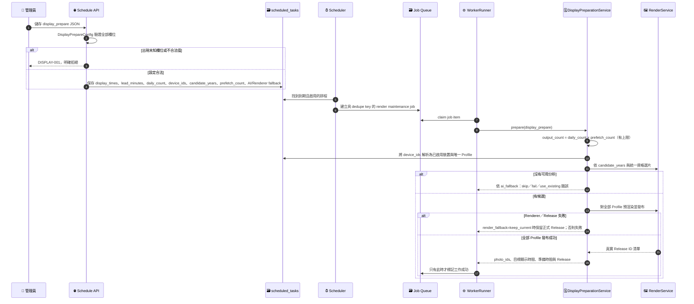
```mermaid
sequenceDiagram
    autonumber
    participant U as 👤 管理員
    participant A as 🌐 Schedule API
    participant DB as 🗃️ scheduled_tasks
    participant S as ⏰ Scheduler
    participant J as 🗃️ Job Queue
    participant W as ⚙️ WorkerRunner
    participant P as 🗓️ DisplayPreparationService
    participant R as 🖼️ RenderService

    U->>A: 儲存 display_prepare JSON
    A->>A: DisplayPrepareConfig 驗證全部欄位
    alt 出現未知欄位或不合法值
        A-->>U: DISPLAY-001，明確拒絕
    else 設定合法
        A->>DB: 保存 display_times、lead_minutes、daily_count、device_ids、candidate_years、prefetch_count、AI/Renderer fallback
    end
    S->>DB: 找到到期且啟用的排程
    S->>J: 建立具 dedupe key 的 render maintenance job
    W->>J: claim job item
    W->>P: prepare(display_prepare)
    P->>P: output_count = daily_count × prefetch_count（有上限）
    P->>DB: 將 device_ids 解析為已啟用裝置與唯一 Profile
    P->>R: 依 candidate_years 與統一資格選片
    alt 沒有可用分析
        P-->>W: 依 ai_fallback：skip／fail／use_existing 錯誤
    else 有候選
        P->>R: 對全部 Profile 預渲染並發布
        alt Renderer／Release 失敗
            P-->>W: render_fallback=keep_current 時保留正式 Release；否則失敗
        else 全部 Profile 發布成功
            R-->>P: 真實 Release ID 清單
            P-->>W: photo_ids、目標顯示時間、準備時間與 Release
            W->>J: 只有此時才標記工作成功
        end
    end
```

程式入口：`repositories/schedules.py` → `workers/scheduler.py` → `workers/runner.py` → `services/display_prepare.py` → `services/rendering.py`。

### 7. Server Renderer 與可補償的兩階段 Release

這是「檔案系統操作 + SQLite Transaction + 失敗補償」，不是跨檔案系統與 SQLite 的單一 ACID Transaction。

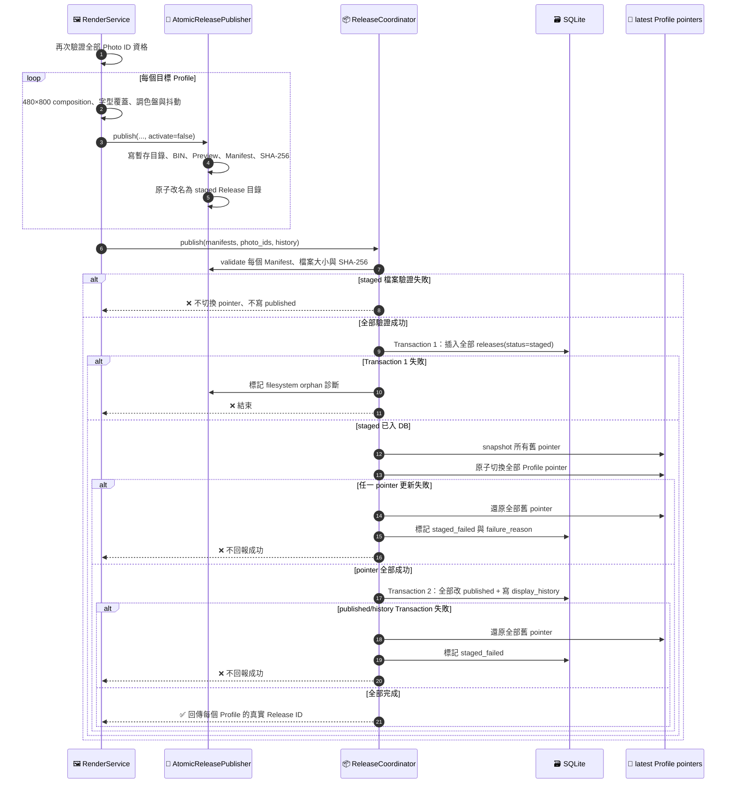
```mermaid
sequenceDiagram
    autonumber
    participant R as 🖼️ RenderService
    participant F as 📁 AtomicReleasePublisher
    participant C as 📦 ReleaseCoordinator
    participant DB as 🗃️ SQLite
    participant P as 📌 latest Profile pointers

    R->>R: 再次驗證全部 Photo ID 資格
    loop 每個目標 Profile
        R->>R: 480×800 composition、字型覆蓋、調色盤與抖動
        R->>F: publish(..., activate=false)
        F->>F: 寫暫存目錄、BIN、Preview、Manifest、SHA-256
        F->>F: 原子改名為 staged Release 目錄
    end
    R->>C: publish(manifests, photo_ids, history)
    C->>F: validate 每個 Manifest、檔案大小與 SHA-256
    alt staged 檔案驗證失敗
        C-->>R: ❌ 不切換 pointer、不寫 published
    else 全部驗證成功
        C->>DB: Transaction 1：插入全部 releases(status=staged)
        alt Transaction 1 失敗
            C->>F: 標記 filesystem orphan 診斷
            C-->>R: ❌ 結束
        else staged 已入 DB
            C->>P: snapshot 所有舊 pointer
            C->>P: 原子切換全部 Profile pointer
            alt 任一 pointer 更新失敗
                C->>P: 還原全部舊 pointer
                C->>DB: 標記 staged_failed 與 failure_reason
                C-->>R: ❌ 不回報成功
            else pointer 全部成功
                C->>DB: Transaction 2：全部改 published + 寫 display_history
                alt published/history Transaction 失敗
                    C->>P: 還原全部舊 pointer
                    C->>DB: 標記 staged_failed
                    C-->>R: ❌ 不回報成功
                else 全部完成
                    C-->>R: ✅ 回傳每個 Profile 的真實 Release ID
                end
            end
        end
    end
```

### 8. Worker 有界佇列、Timeout 與晚到結果

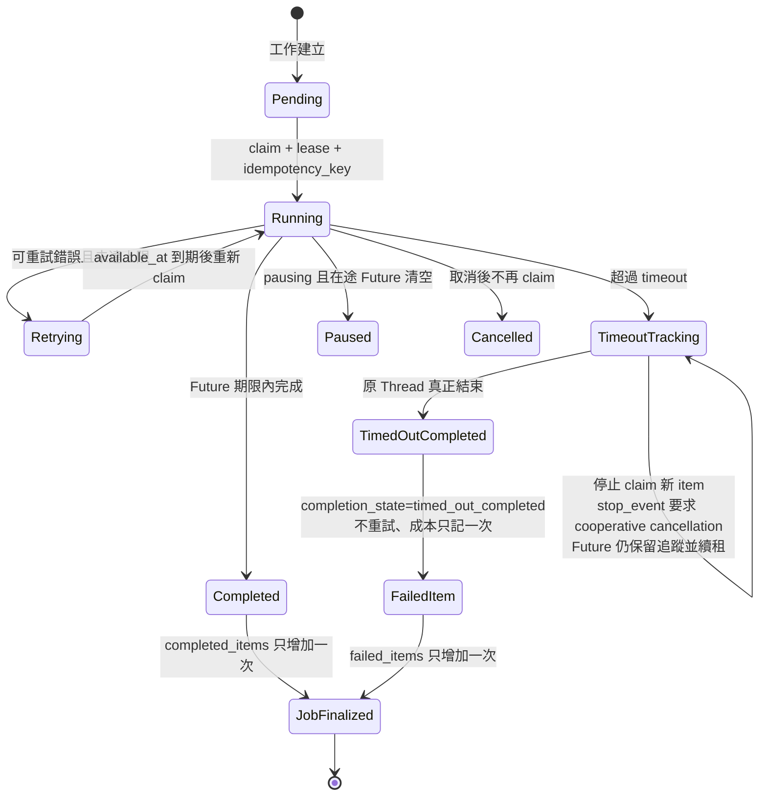
```mermaid
stateDiagram-v2
    [*] --> Pending: 工作建立
    Pending --> Running: claim + lease + idempotency_key
    Running --> Completed: Future 期限內完成
    Running --> Retrying: 可重試錯誤且未達上限
    Retrying --> Running: available_at 到期後重新 claim
    Running --> TimeoutTracking: 超過 timeout
    TimeoutTracking --> TimeoutTracking: 停止 claim 新 item<br/>stop_event 要求 cooperative cancellation<br/>Future 仍保留追蹤並續租
    TimeoutTracking --> TimedOutCompleted: 原 Thread 真正結束
    TimedOutCompleted --> FailedItem: completion_state=timed_out_completed<br/>不重試、成本只記一次
    Running --> Paused: pausing 且在途 Future 清空
    Running --> Cancelled: 取消後不再 claim
    Completed --> JobFinalized: completed_items 只增加一次
    FailedItem --> JobFinalized: failed_items 只增加一次
    JobFinalized --> [*]
```

Worker 只維持 `concurrency × queue_multiplier` 個 Future。Python Thread 無法安全強制終止，因此 Timeout 後採「停止新增副作用、保留追蹤、等待實際結束、晚到結果只留診斷」；不全面改成 Process。

### 9. ESP32 正式 Release 與一次性裝置測試 Release

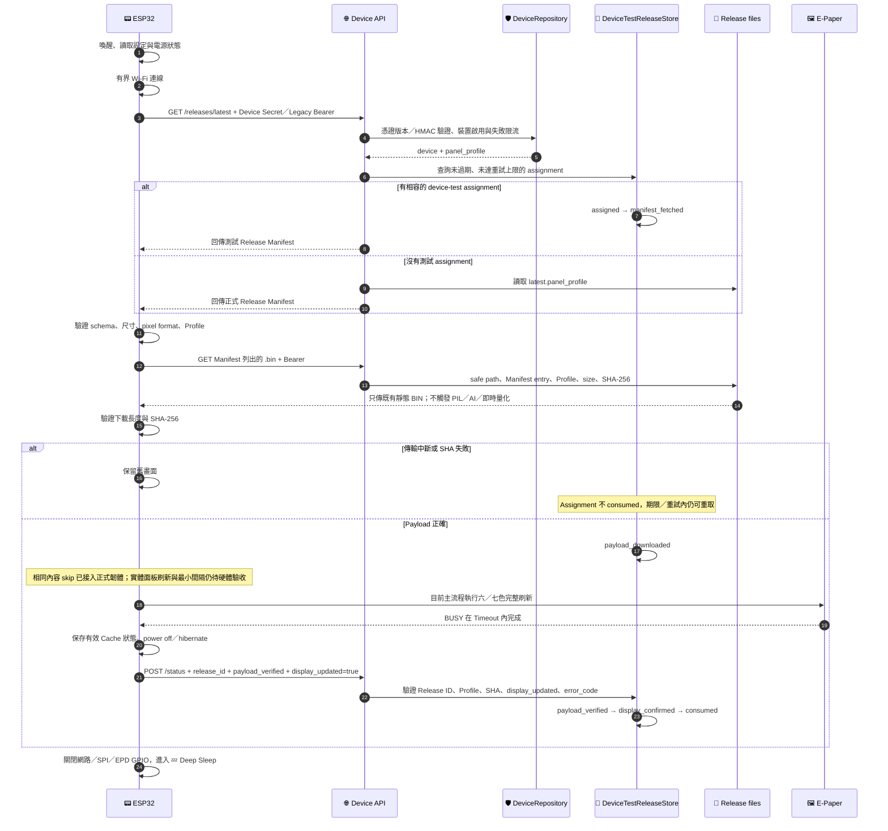
```mermaid
sequenceDiagram
    autonumber
    participant E as 📟 ESP32
    participant A as 🌐 Device API
    participant D as 🛡️ DeviceRepository
    participant T as 🧪 DeviceTestReleaseStore
    participant F as 📁 Release files
    participant P as 🖼️ E-Paper

    E->>E: 喚醒、讀取設定與電源狀態
    E->>E: 有界 Wi-Fi 連線
    E->>A: GET /releases/latest + Device Secret／Legacy Bearer
    A->>D: 憑證版本／HMAC 驗證、裝置啟用與失敗限流
    D-->>A: device + panel_profile
    A->>T: 查詢未過期、未達重試上限的 assignment
    alt 有相容的 device-test assignment
        T->>T: assigned → manifest_fetched
        A-->>E: 回傳測試 Release Manifest
    else 沒有測試 assignment
        A->>F: 讀取 latest.panel_profile
        A-->>E: 回傳正式 Release Manifest
    end
    E->>E: 驗證 schema、尺寸、pixel format、Profile
    E->>A: GET Manifest 列出的 .bin + Bearer
    A->>F: safe path、Manifest entry、Profile、size、SHA-256
    F-->>E: 只傳既有靜態 BIN；不觸發 PIL／AI／即時量化
    E->>E: 驗證下載長度與 SHA-256
    alt 傳輸中斷或 SHA 失敗
        E->>E: 保留舊畫面
        Note over T: Assignment 不 consumed，期限／重試內仍可重取
    else Payload 正確
        T->>T: payload_downloaded
        Note over E: 相同內容 skip 已接入正式韌體；實體面板刷新與最小間隔仍待硬體驗收
        E->>P: 目前主流程執行六／七色完整刷新
        P-->>E: BUSY 在 Timeout 內完成
        E->>E: 保存有效 Cache 狀態、power off／hibernate
        E->>A: POST /status + release_id + payload_verified + display_updated=true
        A->>T: 驗證 Release ID、Profile、SHA、display_updated、error_code
        T->>T: payload_verified → display_confirmed → consumed
    end
    E->>E: 關閉網路／SPI／EPD GPIO，進入 💤 Deep Sleep
```

六／七色 Profile 明確為 `supports_partial_refresh=false`、`requires_full_refresh=true`。未有驅動與面板資料表證據前，不加入 Partial Refresh。

### 10. 備份、離線還原與 Release reconciliation

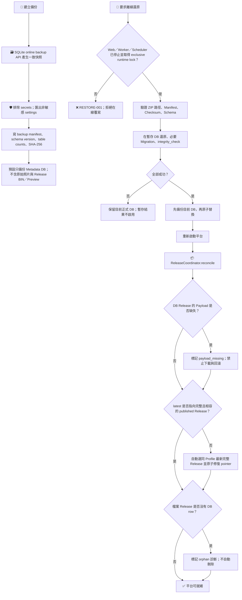
```mermaid
flowchart TD
    BACKUP["👤 建立備份"] --> SNAPSHOT["🗃️ SQLite online backup API 產生一致快照"]
    SNAPSHOT --> SANITIZE["🛡️ 排除 secrets；匯出非敏感 settings"]
    SANITIZE --> MANIFEST["寫 backup manifest、schema version、table counts、SHA-256"]
    MANIFEST --> SCOPE["預設只備份 Metadata DB；不含原始照片與 Release BIN／Preview"]

    RESTORE["👤 要求離線還原"] --> LOCK{"Web／Worker／Scheduler 已停止並取得 exclusive runtime lock？"}
    LOCK -->|否| BLOCK["❌ RESTORE-001；拒絕在線覆寫"]
    LOCK -->|是| VALIDATE["驗證 ZIP 路徑、Manifest、Checksum、Schema"]
    VALIDATE --> TEMP["在暫存 DB 還原、必要 Migration、integrity_check"]
    TEMP --> OK{"全部成功？"}
    OK -->|否| ROLLBACK["保留目前正式 DB；暫存結果不啟用"]
    OK -->|是| SAFETY["先備份目前 DB，再原子替換"]
    SAFETY --> START["重新啟動平台"]
    START --> RECON["📦 ReleaseCoordinator.reconcile"]
    RECON --> DB_MISSING{"DB Release 的 Payload 是否缺失？"}
    DB_MISSING -->|是| MARK_MISSING["標記 payload_missing；禁止下載與回滾"]
    DB_MISSING -->|否| POINTER{"latest 是否指向完整且相容的 published Release？"}
    POINTER -->|否| RECOVER["自動選同 Profile 最新完整 Release 並原子修復 pointer"]
    POINTER -->|是| FS_ORPHAN{"檔案 Release 是否沒有 DB row？"}
    RECOVER --> FS_ORPHAN
    FS_ORPHAN -->|是| ORPHAN["標記 orphan 診斷；不自動刪除"]
    FS_ORPHAN -->|否| READY2["✅ 平台可就緒"]
    ORPHAN --> READY2
    MARK_MISSING --> POINTER
```

### 11. 核心資料關係

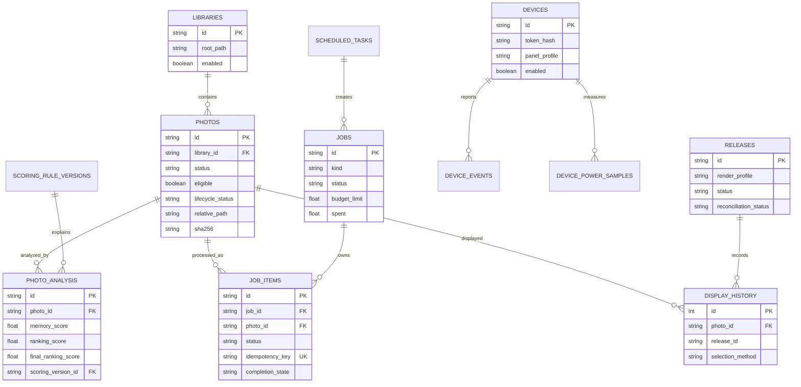
```mermaid
erDiagram
    LIBRARIES ||--o{ PHOTOS : contains
    PHOTOS ||--o{ PHOTO_ANALYSIS : analyzed_by
    PHOTOS ||--o{ JOB_ITEMS : processed_as
    JOBS ||--o{ JOB_ITEMS : owns
    PHOTOS ||--o{ DISPLAY_HISTORY : displayed
    RELEASES ||--o{ DISPLAY_HISTORY : records
    DEVICES ||--o{ DEVICE_EVENTS : reports
    DEVICES ||--o{ DEVICE_POWER_SAMPLES : measures
    SCHEDULED_TASKS ||--o{ JOBS : creates
    SCORING_RULE_VERSIONS ||--o{ PHOTO_ANALYSIS : explains

    LIBRARIES {
        string id PK
        string root_path
        boolean enabled
    }
    PHOTOS {
        string id PK
        string library_id FK
        string status
        boolean eligible
        string lifecycle_status
        string relative_path
        string sha256
    }
    PHOTO_ANALYSIS {
        string id PK
        string photo_id FK
        float memory_score
        float ranking_score
        float final_ranking_score
        string scoring_version_id FK
    }
    JOBS {
        string id PK
        string kind
        string status
        float budget_limit
        float spent
    }
    JOB_ITEMS {
        string id PK
        string job_id FK
        string photo_id FK
        string status
        string idempotency_key UK
        string completion_state
    }
    RELEASES {
        string id PK
        string render_profile
        string status
        string reconciliation_status
    }
    DISPLAY_HISTORY {
        int id PK
        string photo_id FK
        string release_id
        string selection_method
    }
    DEVICES {
        string id PK
        string token_hash
        string panel_profile
        boolean enabled
    }
```

### 12. 安全與信任邊界

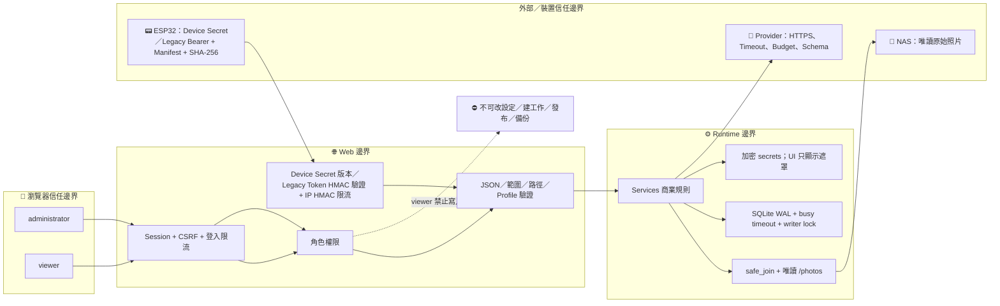
```mermaid
flowchart LR
    subgraph BrowserZone["👤 瀏覽器信任邊界"]
        ADMIN["administrator"]
        VIEWER["viewer"]
    end
    subgraph WebZone["🌐 Web 邊界"]
        SESSION["Session + CSRF + 登入限流"]
        ROLE["角色權限"]
        DEVICE_AUTH["Device Secret 版本／Legacy Token HMAC 驗證 + IP HMAC 限流"]
        VALIDATION["JSON／範圍／路徑／Profile 驗證"]
    end
    subgraph RuntimeZone["⚙️ Runtime 邊界"]
        SERVICES["Services 商業規則"]
        SAFE_PATH["safe_join + 唯讀 /photos"]
        DBLOCK["SQLite WAL + busy timeout + writer lock"]
        SECRETS["加密 secrets；UI 只顯示遮罩"]
    end
    subgraph ExternalZone["外部／裝置信任邊界"]
        AI["🧠 Provider：HTTPS、Timeout、Budget、Schema"]
        ESP32B["📟 ESP32：Device Secret／Legacy Bearer + Manifest + SHA-256"]
        NAS["📁 NAS：唯讀原始照片"]
    end

    ADMIN --> SESSION --> ROLE --> VALIDATION --> SERVICES
    VIEWER --> SESSION --> ROLE
    ROLE -. "viewer 禁止寫入" .-> VIEWER_BLOCK["⛔ 不可改設定／建工作／發布／備份"]
    ESP32B --> DEVICE_AUTH --> VALIDATION
    SERVICES --> SAFE_PATH --> NAS
    SERVICES --> DBLOCK
    SERVICES --> SECRETS
    SERVICES --> AI
```

安全重點：Production 不使用 `os.system`、`os.popen`、`shell=True` 或 ExifTool Shell；裝置 API 只提供預先產生並驗證的靜態 Payload。Device Secret／Bearer Token 是認證而不是傳輸加密，HTTP 只適合隔離 IoT VLAN。

### 13. 失敗時系統保留什麼

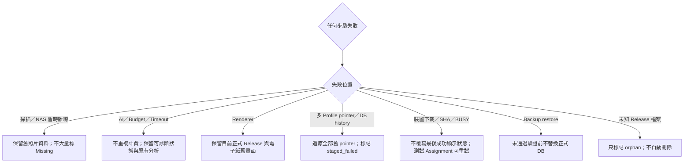
```mermaid
flowchart TD
    FAILURE{"任何步驟失敗"} --> KIND{"失敗位置"}
    KIND -->|掃描／NAS 暫時離線| KEEP_PHOTO["保留舊照片資料；不大量標 Missing"]
    KIND -->|AI／Budget／Timeout| KEEP_ANALYSIS["不重複計費；保留可診斷狀態與既有分析"]
    KIND -->|Renderer| KEEP_RELEASE["保留目前正式 Release 與電子紙舊畫面"]
    KIND -->|多 Profile pointer／DB history| COMPENSATE["還原全部舊 pointer；標記 staged_failed"]
    KIND -->|裝置下載／SHA／BUSY| KEEP_DISPLAY["不覆寫最後成功顯示狀態；測試 Assignment 可重試"]
    KIND -->|Backup restore| KEEP_DB["未通過驗證前不替換正式 DB"]
    KIND -->|未知 Release 檔案| KEEP_ORPHAN["只標記 orphan；不自動刪除"]
```

更細的錯誤碼與操作步驟請見[錯誤碼](docs/operations/ERROR_CODES_ZH_TW.md)、[疑難排解](docs/operations/TROUBLESHOOTING_ZH_TW.md)、[備份還原](docs/operations/BACKUP_RESTORE_ZH_TW.md)與[最終跨模組稽核（歷史）](docs/archive/reports/FINAL_CROSS_MODULE_HARDENING_REVIEW_ZH_TW.md)。

## Docker 快速安裝

需求：Docker Engine 24+ 與 Compose v2。請先選擇部署模式，不要混用 HTTP 與 Secure Cookie 設定。

可信任 LAN Production HTTP（僅可信任 LAN／IoT VLAN）：

```bash
cp .env.lan.production.example .env
# 換成實際 LAN URL、絕對 data/photos 路徑與 immutable Git SHA。
python scripts/production_preflight.py --mode lan --env-file .env
scripts/build_release_image.sh
docker compose up -d
```

這個模式仍是 `INKTIME_ENVIRONMENT=production`，使用 `INKTIME_COOKIE_SECURE=0` 與明確的 `INKTIME_ALLOW_INSECURE_HTTP=1`。Health／diagnostics 會顯示 `transport=trusted-lan-http`、`security_state=degraded`、`tls_enabled=false` 與 `secure_cookie=false`；不可直接公開到 Internet。`.env.local.example` 只供 development／模擬。

正式 HTTPS Reverse Proxy：

```bash
cp .env.production.example .env
# 必須先把範例網域改成實際 HTTPS 網址，並確認 Proxy Trust。
docker compose up -d --build
```

Production 預設且建議使用 `INKTIME_COOKIE_SECURE=1`、`INKTIME_ALLOW_INSECURE_HTTP=0`。若在特殊受控環境明確改成 `INKTIME_ALLOW_INSECURE_HTTP=1`／`INKTIME_COOKIE_SECURE=0`，系統可用 break-glass HTTP 啟動，但 Health／Preflight 會標示 degraded；此模式不可公開至 Internet，且沒有 Secure Cookie、HSTS 或 TLS 保證。不合理組合、localhost／範例 Production 網域、URL 內帳密或路徑會讓啟動明確失敗。首次管理員帳號需 3–64 個 ASCII 識別字元，密碼需 12–128 字元；密碼前後空白會被保留。

三個服務使用同一映像檔：

- `inktime-web`：Gunicorn 管理介面與裝置 API。
- `inktime-worker`：照片掃描、分析、重試與渲染工作。
- `inktime-scheduler`：租約回收、每日備份與保留策略。

完整 N100 資源上限、Volume 權限、健康檢查、HTTPS、更新與回滾見 [Docker 部署規格](docs/operations/DOCKER_GUIDE_ZH_TW.md)。

## 首次使用

1. 建立管理員並登入。
2. 尚未準備模型或電子紙時，可將照片放進 `simulation_photos/`，到「維護」按「掃描並送到虛擬墨水屏」，再用獨立的 `/virtual-display` 接收正式 Manifest 與 BIN；這個流程不會呼叫模型。
3. 要啟用智慧選片時，到「模型」新增 OpenAI、OpenAI 相容或本地端點；API Key 加密儲存且只顯示遮罩。
4. 到「維護」輸入容器內照片路徑（Compose 預設 `/photos`），建立背景掃描工作。
5. 到「工作」建立兩階段智慧分析，確認照片數、Token、費用範圍與工作預算後啟動。
6. 到「渲染」預覽並選擇內建的手寫／文青繁中字型，測試渲染後發布 2bpp 版本；需要時仍可上傳其他字型。
7. 新自製板不必先在「裝置」建立資料列：AP 設定頁只填 Wi-Fi／InkTime URL，裝置首次連線會取得短期配對碼，管理員在 Web 核准後自動領取 Device Secret，再於「裝置」頁調整名稱與排程。既有 Legacy 或 Stock 裝置依相容模式操作。
8. 到「備份」建立並下載第一份備份。

## 歷史今日與安全換圖

「渲染」頁的「歷史今日／隨機一天」可依年份、人物／旅行／風景、城市、國家、近期顯示紀錄與未顯示狀態選擇歷史日期。候選一律要求為合格、非 Missing、非人工排除且原始檔目前可讀；沒有結果時會保留所有篩選條件並明確提示，不會改選被排除的照片。

選定日期後可同日重抽（跨年份），支援完全隨機、最終分數加權、前 N 名與人物／旅行偏好，且不會立刻抽回目前照片。正式 Release 會經由背景 Worker 與 Server Renderer 建立，完成後才寫入顯示歷史；「傳送到墨水屏測試」同樣由 Server Renderer 產生獨立 device-test Release，不覆寫正式排程。

## 不用修改程式碼的日常設定

一般、分析、Worker 待機、模型、成本、渲染、裝置、Log 層級、安全與備份設定都在「設定」頁。每次修改會記錄時間、使用者、來源 IP、舊值／新值摘要與生效方式；Secret 不會寫入歷史。只有 Volume、Port、映像、HTTPS 與 Docker cgroup／Log 輪替屬於一次性部署邊界。完整欄位、預設值、範圍與風險見 [管理指南](docs/guides/ADMIN_GUIDE_ZH_TW.md)。

## 照片評分與模型調整在哪裡

管理介面的「設定」與「評分」頁可調整：

- `model.low_model`、`model.high_model`：第一、第二階段使用哪個模型。
- 「評分」頁：照片高低分規則、四項綜合排序權重、最愛加分、版本歷史與單張測試台。
- `analysis.stage_two_threshold`：第一階段的回憶分達到多少才升級到高品質分析；人物或最愛照片也會升級。
- `render.memory_threshold`：電子紙歷史今日選片的最低回憶分門檻。

四項模型原始分數 `memory_score`、`beauty_score`、`technical_quality_score`、`emotion_score` 永遠保留；系統另以版本化權重計算 `ranking_score`，預設為回憶 50%、美觀 20%、技術 10%、情緒 20%，最愛照片再加 5 分（最高 100）。新規則只影響之後的分析；每筆分析會記住使用的規則版本。測試台照片只在暫存目錄停留，但模型 Token 與費用仍會記入成本頁。完整資料流見 [專案架構與評分流程](docs/architecture/ARCHITECTURE_ZH_TW.md)。

## Token 與成本控制

建議預設使用「兩階段智慧分析」：512px 低成本初篩，只有回憶分數達門檻、人物或最愛照片才使用 1600px 高品質模型。相同 SHA-256 繼承既有結果；短文案與所有分數在同一階段圖片請求輸出。管理介面提供每日、每月、單工作與單張照片停止值。詳見 [Token 成本指南](docs/reference/TOKEN_COST_GUIDE_ZH_TW.md)。

## ESP32 配對與可靠性

新版韌體不再把金鑰放在 URL。新自製裝置以自動配對取得一次性領取的 Device Secret 與 credential version；既有裝置仍可用 Legacy Bearer Token，PhotoPainter Stock 維持 `/dataUP` 並不進入配對流程。裝置以對應憑證取得專屬面板 Profile 的 Manifest，優先讀取 Offline Queue，嚴格驗證 Item 綁定的相對下載 URL、尺寸、格式、長度與 SHA-256；只有 Queue 404／空白才回退 Latest Release。顯示事件先持久化 NVS，再以 canonical `/api/device/v1/queue/ack` 重送穩定 idempotency key；成功顯示的 SHA／Release／Profile／rotation／board 完全相同時可安全跳過刷新，forced refresh 與狀態損壞會 fail closed。裝置也會回報設定 ACK、firmware、RSSI、Heap／PSRAM 與最後錯誤。既有 EOL GDEY073D46 與新 GDEP073E01 有不同 compile profile；Scheduler 以低頻掃描建立離線／恢復通知，可選去重 Webhook。完整設定見[裝置可靠性與六／七色渲染指南](docs/devices/DEVICE_COLOR_NOTIFICATION_GUIDE_ZH_TW.md)與[ESP32 自動配對與憑證生命週期](docs/devices/ESP32_AUTOMATIC_PAIRING_ZH_TW.md)。

## 原生安裝與相容 CLI

需求為 Python 3.10+（正式映像使用 Python 3.12）：

```bash
python3 -m venv .venv
source .venv/bin/activate
pip install -r requirements.txt
python server.py                 # 僅本機開發
python -m inktime.app.workers.runner
```

正式環境不可使用 Flask Development Server；請使用 Docker 或 `gunicorn server:app`。舊 `analyze_photos.py` 命令仍可使用，但已改為建立新版持久化 Job；原單檔實作保存在 `legacy_analyze_photos.py` 供遷移比較，不建議執行。

## 安全注意事項

- 不要 Commit `.env`、`config.py`、資料庫、Session Key、API Key、Device Secret 或 Legacy 裝置 Token。
- 公網部署必須使用 HTTPS、Secure Cookie、反向代理限流與 NAS 最小權限。
- HTTP 模式只可用於可信任 LAN／測試；`INKTIME_COOKIE_SECURE=0` 不適合公開網路。
- Reverse Proxy 必須只傳入可信任來源的 `Host`、`X-Forwarded-Proto` 與 `X-Forwarded-For`，且 `INKTIME_PROXY_TRUST` 要等於實際 Proxy hop 數。
- Webhook 會把通知內容送到外部服務；目的地只允許 DNS-pinned HTTPS、禁止 redirect 與內部位址，Bearer Token 仍應視為高敏感 Secret。
- Device Secret 只在自動配對 claim 回應中交付一次；Legacy Token 仍只存於裝置受保護設定。兩者都不要放進 URL、Log、截圖或文件。
- 舊 `/static/inktime/<key>/...` API 預設關閉；只有隔離網路短期遷移才可明確開啟。
- viewer 只能查看，不能修改設定、建立／控制工作、管理配對／憑證、發布或備份。

詳見 [安全指南](docs/operations/SECURITY_GUIDE_ZH_TW.md)與[錯誤碼](docs/operations/ERROR_CODES_ZH_TW.md)。

## 更新、遷移與回滾

更新前先從介面建立備份，再拉取映像並執行 `docker compose up -d --build`。Migration 使用版本、狀態歷史、單一交易、升級前備份與完整 `integrity_check`；任何失敗或未完成狀態都會停止啟動。回滾時停止三個服務，使用離線還原工具驗證並原子恢復舊資料庫與映像。詳細步驟見 [遷移指南](docs/operations/MIGRATION_GUIDE_ZH_TW.md)與[備份還原](docs/operations/BACKUP_RESTORE_ZH_TW.md)。

## 常見問題

- 沒有照片：到「維護」確認容器路徑是 `/photos` 且 Volume 可讀。
- 工作不動：到「診斷」確認 Worker 與 Queue，再看「錯誤中心」。
- 模型結果無效：確認模型支援 JSON Schema；系統只修復一次，避免無限成本。
- 繁中變方框：到「渲染」確認已選取內建芫荽／霞鶩文楷 TC，或上傳涵蓋短文案所有字元的繁中字型；系統不會靜默改用 PIL 預設字型。
- 裝置 401／403：Device Secret／credential version 已撤銷、Legacy Token 錯誤或裝置被停用；自動模式請由管理員啟用重新配對，Legacy 模式才重新產生並更新 Token。

更多處理方式見 [疑難排解](docs/operations/TROUBLESHOOTING_ZH_TW.md)。效能證據見 [100,000 筆報告](docs/reports/PERFORMANCE_REPORT.md)，歷史完成邊界見 [實作報告](docs/archive/reports/FINAL_IMPLEMENTATION_REPORT_ZH_TW.md)。

## 正式發布與裝置安全邊界

- 一般發布、歷史選片與排程共用同一候選資格：已分析、可選、active、最新分析存在，而且原始檔仍位於啟用的 Library Root。
- Release 先產生 staged 檔案並驗證 Manifest／大小／SHA-256，再以補償式流程切換 Profile pointer、提交 DB 與 `display_history`。啟動時標記漂移，失效 pointer 可回復到同 Profile 最新完整版本，但不自動刪除未知 Release。
- 裝置仍使用 `Authorization: Bearer`；自動模式另帶 `X-InkTime-Credential-Version`，Legacy 模式維持相容 Token。Device Secret／Bearer Token 不會加密 HTTP；HTTP 只適合隔離 IoT VLAN，跨網路必須使用已驗證 CA 的 HTTPS 或 VPN。
- 六／七色 Profile 明確宣告不支援 Partial Refresh；正式韌體已實作經驗證的相同內容跳過刷新，但真實面板的 BUSY、方向、殘影、色彩與功耗仍須實體驗收。
- 預設備份只有 Metadata DB，不含原始照片或 Release Payload。還原後會進行 Release reconciliation。

詳見[裝置傳輸安全](docs/devices/DEVICE_TRANSPORT_SECURITY_ZH_TW.md)、[安全 OTA 設計](docs/devices/SECURE_OTA_DESIGN_ZH_TW.md)與[最終跨模組稽核（歷史）](docs/archive/reports/FINAL_CROSS_MODULE_HARDENING_REVIEW_ZH_TW.md)。

## 授權

本專案依原始儲存庫授權條款發布；ESP32 使用的第三方函式庫另依其授權。內建芫荽與霞鶩文楷 TC 均採 SIL Open Font License 1.1，授權全文與固定版本資訊隨字型資產附上。
