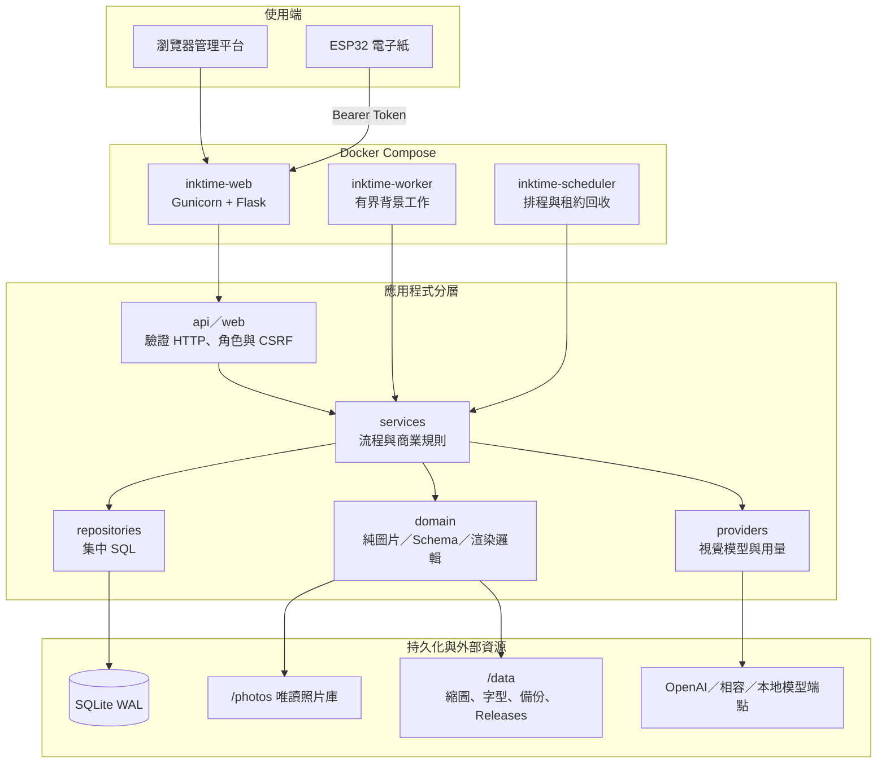
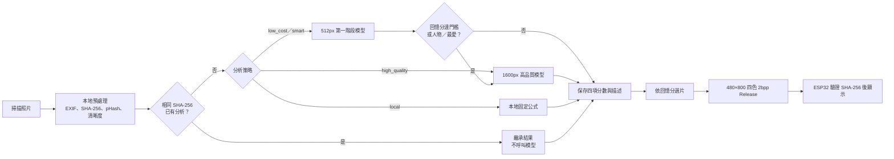
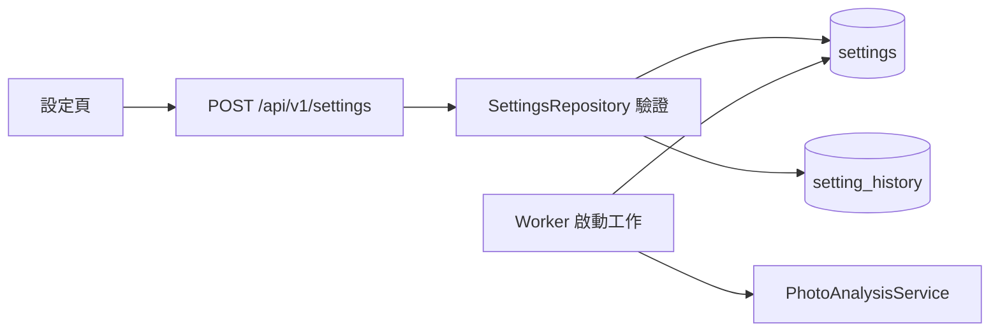

# InkTime 專案架構與照片評分流程

這份文件是閱讀程式碼的入口。先看「執行架構」，再依要修改的功能查「模組地圖」；照片評分、模型與門檻集中在後半段。

## 執行架構

三個容器共用同一個映像與 `/data`，但責任不同：Web 不執行長時間圖片工作；Worker 從 SQLite 領取有租約的工作；Scheduler 處理排程、恢復與備份。

## 模組地圖

| 想修改的功能 | 先看哪裡 | 下一層 |
|---|---|---|
| 登入、權限、CSRF | `inktime/app/api/auth.py`、`web/access.py` | `repositories/auth.py`、`core/security.py` |
| 照片掃描與本地特徵 | `workers/scanner.py` | `domain/photos/preprocessing.py`、`repositories/photos.py` |
| 模型分析與兩階段判斷 | `services/analysis.py` | `providers/openai_compatible.py`、`domain/analysis/schema.py` |
| 背景工作、暫停與恢復 | `workers/runner.py`、`workers/job_worker.py` | `repositories/jobs.py` |
| 模型路由、限流與熔斷 | `providers/router.py` | `services/providers.py`、`repositories/providers.py` |
| Token、成本與停止線 | `services/budgets.py` | `repositories/usage.py`、`repositories/settings.py` |
| 電子紙渲染與發布 | `services/rendering.py` | `domain/rendering/`、`api/rendering.py` |
| 裝置 Token 與下載 | `api/devices.py` | `repositories/devices.py`、`esp32/` |
| 管理介面 | `web/templates/` | `web/static/`、對應的 `api/*.py` |
| Docker 與啟動 | `docker-compose.yml`、`Dockerfile` | `server.py`、`platform.py` |

## 照片從掃描到發布

## 評分與「權重」的實際狀態

模型一次回傳四個獨立分數：

| 分數 | 意義 | 現在由誰決定 |
|---|---|---|
| `memory_score` | 值得回憶程度 | 視覺模型依固定 Prompt 判斷 |
| `beauty_score` | 美觀程度 | 視覺模型依固定 Prompt 判斷 |
| `technical_quality_score` | 清晰、曝光、構圖等技術品質 | 視覺模型依固定 Prompt 判斷 |
| `emotion_score` | 情緒與故事性 | 視覺模型依固定 Prompt 判斷 |

目前沒有把四項分數乘上百分比後合成總分的邏輯，也沒有管理介面權重滑桿。`memory_score` 不是加權總分；它是模型直接輸出的回憶分。不要把 `analysis.stage_two_threshold` 或 `render.memory_threshold` 誤認為權重，兩者都是門檻。

### 不改程式碼可以調整的項目

登入管理平台後開啟「設定」：

| 設定鍵 | 用途 | 預設值 |
|---|---|---:|
| `model.low_model` | 第一階段低成本模型 | `gpt-4o-mini` |
| `model.high_model` | 第二階段高品質模型 | `gpt-4o` |
| `analysis.stage_two_threshold` | 第一階段回憶分達此值才升級；人物／最愛例外 | 65 |
| `render.memory_threshold` | 電子紙候選照片最低回憶分 | 70 |

建立工作時可在「工作」頁選擇 `local`、`low_cost`、`high_quality` 或 `smart_two_stage`。Provider、Base URL、API Key、價格與優先順序在「模型」頁管理。

### 要改評分規則時看哪裡

- 新版模型固定 Prompt：`inktime/app/providers/openai_compatible.py` 的 `SYSTEM_PROMPT`。
- 分數欄位、型別與 0–100 範圍：`inktime/app/domain/analysis/schema.py`。
- 兩階段門檻判斷：`inktime/app/services/analysis.py` 的 `requires_second`。
- 僅本地策略的固定分數公式：同檔案的 `_local_result()`。
- Worker 如何讀取設定：`inktime/app/workers/runner.py`。
- 電子紙自動選片排序：`inktime/app/services/rendering.py`。
- 舊版較長的回憶分／美觀分評分細則：`legacy_analyze_photos.py`；新版流程不會載入此檔案。

若要新增真正的可調權重，應另外定義「綜合排序分數」，保留四個模型原始分數，再以版本化設定計算並保存綜合分；不應覆寫 `memory_score`，否則舊分析結果會失去可比較性。

## 設定與資料流

一般設定保存在 SQLite 的 `settings`／`setting_history`，定義與驗證位於 `repositories/settings.py`；API Key 等敏感值保存在加密的 `secrets`。`.env` 只放部署層路徑、Cookie 與 Log 等啟動參數，不是日常模型評分設定。

## 建議閱讀順序

1. `README.md`：功能、部署與主要入口。
2. 本文件：執行架構、模組地圖與評分流程。
3. `inktime/app/platform.py`：應用程式如何組裝 Repository、Service 與 Blueprint。
4. 依上方模組地圖進入目標功能。
5. `docs/FINAL_IMPLEMENTATION_REPORT_ZH_TW.md`：完成證據與已知限制。
