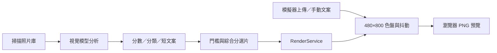

# 電子紙模擬器與模型接入指南

## 虛擬墨水屏接收端

`/virtual-display` 是獨立、唯讀的裝置接收頁。它不提供照片上傳、內容編輯或發布操作，而是每 5 秒接收目前 Profile 的正式 Manifest，再下載 Manifest 指定的同一份 `.bin`。接收端會驗證檔案大小與 SHA-256，依 `2bpp`／`indexed4` 和 Manifest 色盤解碼成 480×800 畫面，並顯示輪詢次數、Release 數、資料量、延遲、色彩分布與 Debug 紀錄。

本機快速流程：

1. 把照片放入專案的 `simulation_photos/`（Docker 容器內固定為 `/photos`）。
2. 到「維護」按「掃描並送到虛擬墨水屏」。這個背景工作只做增量掃描與正式色盤發布，不呼叫 Provider。
3. 另開 `/virtual-display`。工作完成後，接收頁會自動顯示新 Release；不需在接收頁執行任何操作。

這條路徑產生的 Release 也符合 ESP32 的正式 Manifest／BIN 契約，因此虛擬頁顯示的不是 CSS 濾鏡或另外產生的近似圖。

## 先不接模型也能測什麼

登入 InkTime 後開啟「模擬器」或 `/simulator`，可直接上傳 JPG、PNG、WebP，或載入內建測試圖。模擬器會：

1. 在瀏覽器組成與正式渲染相同的 480×800 直式畫布。
2. 可手動輸入短文案，完全不等待模型產生內容。
3. 呼叫本機 `/api/v1/rendering/simulate`，套用正式發布共用的 Profile、OKLab 色差與抖動演算法。
4. 回傳純面板色的 PNG，可比較裁切、留白、色偏、顆粒與文字可讀性。

此 API 不查照片資料庫、不建立 Job、不寫入 Release、不呼叫 Provider。上傳檔只存在單次請求的暫存目錄；最多 25 MiB／4000 萬像素，處理完成即刪除。回應的 `X-InkTime-Model: disabled` 可用於自動測試確認模型沒有介入。

CSS 電子紙外框、紙張紋理與刷新動畫只協助觀察；下載的 PNG 不含這些裝飾。真正寫入面板的色彩與資料量則使用 `inktime/app/domain/rendering/palette.py` 的相同編碼器。

## 接入模型時不需要改模擬器

模型的責任是「理解與選擇照片」，電子紙渲染器的責任是「把已決定的照片轉成面板格式」。兩條流程最後在 RenderService 會合：

### 從 Web UI 啟用模型

1. 到「模型」新增 Provider：填名稱、完整 Base URL、API Key、優先順序與限制，儲存後先執行連線測試。
2. 到「設定」選擇 `model.low_model`、`model.high_model`，並先設定每日、每月、單工作與單張預算上限。
3. 到「評分」以單張測試台確認模型能回傳符合 Schema 的繁體中文描述、四項分數與 `side_caption`。
4. 到「維護」掃描照片資料夾；掃描只做本地 EXIF、雜湊與影像特徵，不會自行開始付費分析。
5. 到「工作」先用 10～100 張建立 `smart_two_stage` 工作。Worker 會依設定呼叫 Provider，並將分析與用量寫入 SQLite。
6. 到「照片」檢查實際分數與文案；到「成本」確認 Token 與費用。
7. 到「渲染」檢查智慧裁切、E6 六色適合度與版型後發布。預設先選過去年度同月同日的照片，不足才依設定取鄰近日或綜合排名；E6 分數也可加入排序，最後產生裝置可下載的版本。

若只想離線測流程，可在「工作」選擇 `local` 策略。它不呼叫模型，但只使用本地固定公式，不能產生與視覺模型同等的語意描述；排版與色盤仍可先在模擬器完成除錯。

## 要接新的模型供應商時看哪些程式

| 目的 | 主要位置 |
|---|---|
| 新增 OpenAI 相容端點 | Web「模型」頁；通常不必改程式 |
| 改 Provider HTTP／Schema 行為 | `inktime/app/providers/openai_compatible.py` |
| 改路由、優先順序、限流與熔斷 | `inktime/app/providers/router.py`、`inktime/app/services/providers.py` |
| 改模型輸出欄位與驗證 | `inktime/app/domain/analysis/schema.py` |
| 改兩階段分析與預算流程 | `inktime/app/services/analysis.py`、`inktime/app/services/budgets.py` |
| 改背景工作的模型選擇 | `inktime/app/workers/runner.py` |
| 改最終電子紙排版與選片 | `inktime/app/services/rendering.py` |
| 改色盤、抖動或二進位格式 | `inktime/app/domain/rendering/palette.py` |

Provider 必須至少提供 OpenAI 相容的 Chat Completions 回應：`choices[].message.content` 放分析 JSON，`usage` 提供 Token 數。InkTime 會用嚴格 Schema 驗證，最多只做一次不重傳圖片的純文字 JSON 修復，避免無限重試與失控費用。詳細規格見 [模型與 API Provider 指南](API_PROVIDER_GUIDE_ZH_TW.md)及 [Token 成本指南](TOKEN_COST_GUIDE_ZH_TW.md)。
