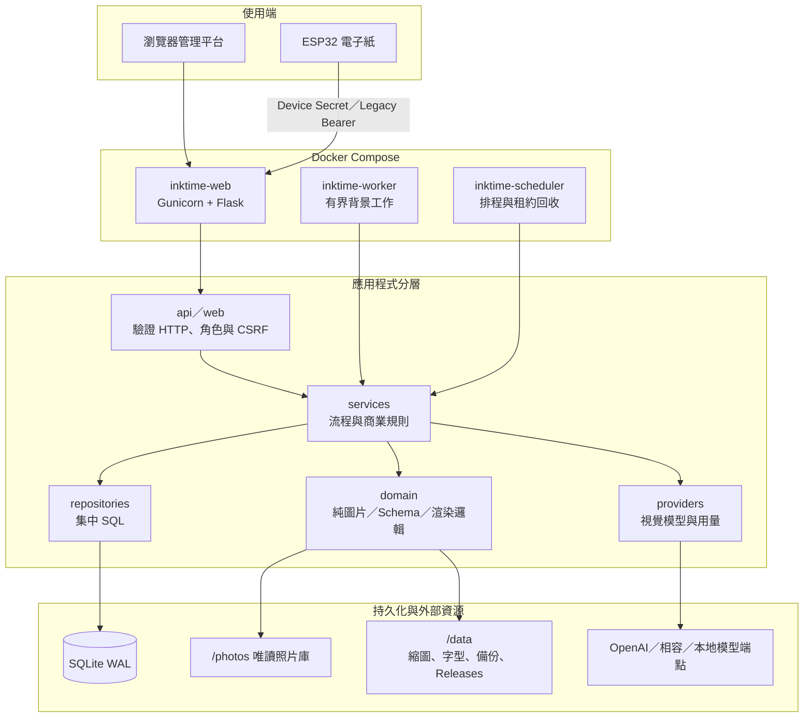
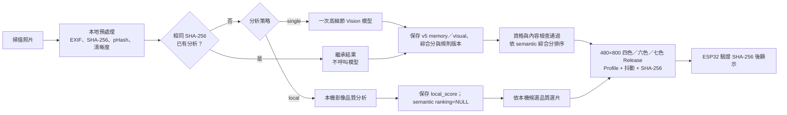
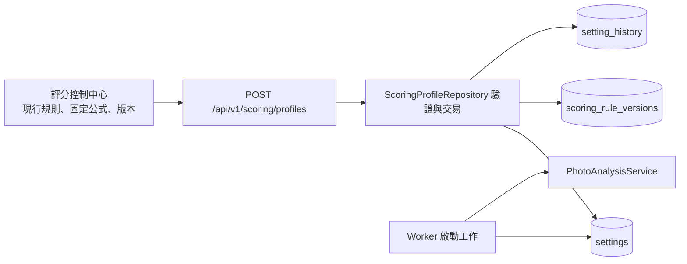

# InkTime 專案架構與照片評分流程

> 現行主線 Migration 63、AI Schema v5 與三程序基線見[版本參考](../reference/CURRENT_STATE_ZH_TW.md)。下文 Migration 22–24 是功能引入歷史，不是目前最高版本。

> 決策與韌性擴充：Migration 22 加入 Decision Trace、回饋、Shadow、Queue、Retention 與 Canary 資料；Migration 23 補強決策關聯，Migration 24 補上分析／Vision Input 指紋。正式發布仍由 `RenderService → ReleaseCoordinator` 管理；追蹤或 Shadow 寫入失敗不會中斷正式 Release。

這份文件是閱讀程式碼的入口。先看「執行架構」，再依要修改的功能查「模組地圖」；照片評分、模型與門檻集中在後半段。

## 執行架構

三個容器共用同一個映像與 `/data`，但責任不同：Web 不執行長時間圖片工作；Worker 從 SQLite 領取有租約的工作；Scheduler 處理排程、恢復與備份。

## 模組地圖

| 想修改的功能 | 先看哪裡 | 下一層 |
|---|---|---|
| 登入、權限、CSRF | `inktime/app/api/auth.py`、`web/access.py` | `repositories/auth.py`、`core/security.py` |
| 照片掃描與本地特徵 | `workers/scanner.py` | `domain/photos/preprocessing.py`、`repositories/photos.py` |
| 單次模型分析與舊策略正規化 | `services/analysis.py`、`domain/analysis/plan.py` | `providers/openai_compatible.py`、`domain/analysis/schema.py` |
| 現行評分規則、固定排名、測試與還原 | `api/scoring.py`、`services/scoring_lab.py` | `repositories/scoring.py`、`domain/analysis/scoring.py` |
| 背景工作、暫停與恢復 | `workers/runner.py`、`workers/job_worker.py` | `repositories/jobs.py` |
| 模型路由、限流與熔斷 | `providers/router.py` | `services/providers.py`、`repositories/providers.py` |
| Token、成本與停止線 | `services/budgets.py` | `repositories/usage.py`、`repositories/settings.py` |
| 電子紙渲染與發布 | `services/rendering.py` | `domain/rendering/`、`api/rendering.py` |
| 裝置自動配對／Legacy Token 與下載 | `api/devices.py`、`api/device_pairing.py` | `repositories/devices.py`、`services/device_pairing.py`、`esp32/` |
| AI 請求追蹤與活動時間軸 | `api/ai_traces.py`、`api/operations.py` | `repositories/ai_traces.py`、`services/observability.py` |
| 安全分析歷史清理 | `repositories/photo_analysis_retention.py` | `api/operations.py` |
| 管理介面 | `web/templates/` | `web/static/`、對應的 `api/*.py` |
| Docker 與啟動 | `docker-compose.yml`、`Dockerfile` | `server.py`、`platform.py` |

## 分層責任與持久化邊界

- API／Web 驗證輸入、角色、CSRF 並建立工作；長時間圖片／模型處理由 Worker 執行。
- Service 編排交易與跨資源操作；Repository 集中 SQL，domain 保持規則與圖片處理邏輯。
- Provider 封裝外部協定與回應，不替代持久化付費狀態與預算帳務。
- `billable_operations` 保存 started／response／completed 等檢查點；`api_usage.operation_id` 維持一次對帳。租約到期不代表請求未送出。
- `budget_reservations` 的未知費用不按年齡自動釋放；Scheduler 僅回收符合未送出／已對帳證據的保留額。
- `runtime_identity` 檢查已知 DB／session key 身分；`ReleaseCoordinator` 補償 DB 與檔案 pointer 的不一致。

需要調整這些行為時，沿本次函式追直接依賴與對應案例，不讀整份 migration、分析服務或所有 integration tests。

## 照片從掃描到發布

## 評分與「權重」的實際狀態

現行 v5／相容 v4 語意分析一次回傳兩個獨立分數；本機品質由 Server 計算：

| 分數 | 意義 | 現在由誰決定 |
|---|---|---|
| `memory_score` | 值得回憶程度 | 視覺模型依固定 Prompt 判斷 |
| `visual_score` | 構圖、光線與整體視覺吸引力 | 視覺模型依固定 Prompt 判斷 |
| `local_quality_score` | 清晰、曝光、解析度與截圖特徵 | Server 本機規則計算 |

`memory_score` 是模型直接輸出的回看價值。只有有效 Schema v5／相容 v4 的 `score_kind=semantic` 結果保存 AI 排名：回憶 67%、視覺 33%，再依特殊程度與最愛提升套用固定 bonus。`automatic_ai` 須本機特徵與模型分析都完成，且照片合格；本機品質只過濾，不加分、不補位。不使用 percentile、照片庫稀有度、E6 加權或最低回憶分。歷史日期模式先限定日期範圍，再依 AI 分數排序。`local_quality` 僅保留品質證據與本機模式候選分；`legacy` 保留歷史，不直接轉換為現行 semantic 排名。

### 不改程式碼可以調整的項目

登入管理平台後，「設定」與「評分」各自負責：

| 設定鍵 | 用途 | 預設值 |
|---|---|---:|
| `model.analysis_model` | 單次完整 Vision 模型 | `gpt-4o` |
| `model.low_model`／`model.high_model` | 舊版模型設定 | 僅讀取相容，不恢復第二次圖片請求 |
| 「評分」控制中心 | 現行規則、固定排名公式、版本歷史與單張測試 | 內建現行 Schema 規則 |
| `analysis.stage_two_threshold` | 舊版兩階段設定的讀取相容欄位 | 65 |
| `render.memory_threshold` | 舊設定相容欄位，自動 AI 選片已不使用 | 70 |

建立工作時可在「工作」頁選擇 `local` 或 `single`。`low_cost`、`smart`、`smart_two_stage`、`high_quality` 與 `single_high` 是舊輸入的讀取相容別名，會正規化為 `single`，不會再次啟用兩階段圖片請求。Provider、Base URL、API Key、價格與 Provider 專屬 `model` 在「模型」頁管理；全域 `model.analysis_model` 在「設定」頁。一般 AI 工作另要求 `analysis.execution_mode=automatic_ai`，新安裝預設 `local_only`。

### 要改評分規則時看哪裡

- 可編輯現行 Prompt 評分細則：管理介面「評分」頁；儲存時建立不可覆寫的歷史版本。排名的 67／33／0 公式與特殊程度 bonus 固定。
- 單張測試：`api/scoring.py` 暫存與刪除上傳檔，`services/scoring_lab.py` 呼叫目前高品質模型並記錄用量。
- 版本保存與還原：`repositories/scoring.py` 與 SQLite `scoring_rule_versions`。
- 評分規則版本化預設：`inktime/app/domain/analysis/scoring.py` 的 `DEFAULT_SCORING_RULES`。
- 不可由網頁覆寫的 JSON／語言／防虛構指令：`inktime/app/providers/openai_compatible.py` 的 `SYSTEM_PROMPT`。
- 分數欄位、型別與 0–100 範圍：`inktime/app/domain/analysis/schema.py`。
- 單次圖片請求界線：`inktime/app/services/analysis.py`；正常照片工作只送一次 Vision，本機抽取 JSON 後驗證，不追加模型 JSON 修復。診斷／評分台／Benchmark 的修復流程另行限制。
- 本機影像品質與候選分：`inktime/app/domain/photos/quality_policy.py` 的 `evaluate_local_quality()` 與 `local_candidate_score()`；不再由 `_local_result()` 產生 semantic ranking。
- Worker 如何讀取設定：`inktime/app/workers/runner.py`。
- 電子紙自動選片排序：`inktime/app/services/rendering.py`。
- 原始評分細則的有效規則已整理為 `inktime/app/domain/analysis/scoring.py` 的版本化預設；Modern runtime 不依賴退役 Analyzer。

新 Prompt 規則只套用到之後的分析；既有照片保留當時的 `ranking_score` 與 `scoring_version_id`。若要回溯比較，應另開重新分析工作。

## 設定與資料流

一般設定保存在 SQLite 的 `settings`／`setting_history`，定義與驗證位於 `repositories/settings.py`；API Key 等敏感值保存在加密的 `secrets`。`.env` 只放部署層路徑、Cookie 與 Log 等啟動參數，不是日常模型評分設定。

## 建議閱讀順序

人類初次了解產品可讀 [`README.md`](../../README.md)；AI 修改依 [AGENTS.md](../../AGENTS.md)，從指定檔案／符號開始，不按文件清單預載。只有啟動組裝問題才讀 `factory.py`／`bootstrap.py`，其餘依模組地圖定位。歷史報告只供特定回歸查證。

## 正式候選與 Release Coordinator

`RenderCandidateRepository` 是一般發布、歷史選片與排程換圖的單一資格來源；API 在明確指定照片時先驗證並以 `RENDER-009` 拒絕，不會靜默 fallback。`DisplayPrepareConfig` 是 Scheduler／Worker／Render 共用 DTO，未知欄位會失敗。

`ReleaseCoordinator` 將檔案系統與 SQLite 組成可補償的兩階段流程：Renderer 以 `activate=False` 建立 staged Release，驗證 Manifest／Payload，DB 寫 staged，切換所有 Profile pointer，最後在同一 DB transaction 寫 published 與 `display_history`。pointer 或 DB 最終提交失敗時回復舊 pointer 並標記 `staged_failed`；啟動 reconciliation 會標記 `payload_missing`／orphan，並將失效 pointer 回復到同 Profile 最新的完整 published Release，但不刪除未知檔案。

共用 `Database` 另提供不含 SQL、Secret 或照片路徑的 writer lock wait、busy timeout count、WAL bytes 與長交易指標；一般 Web、Worker 與 Scheduler Runtime 不得繞過此連線層。
